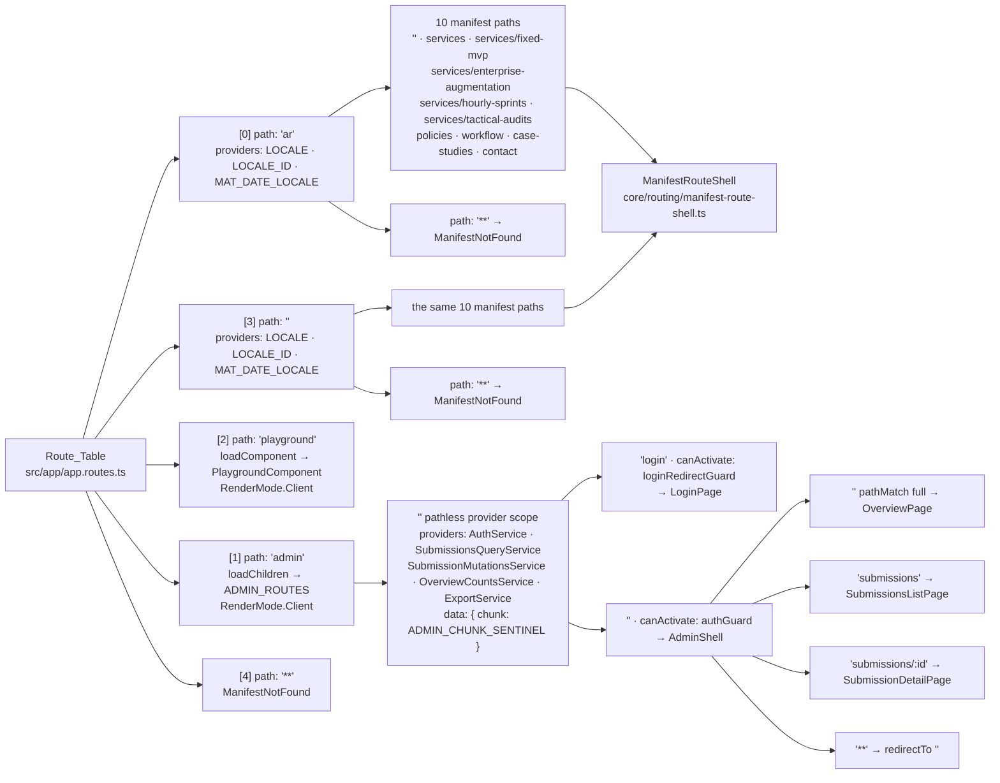

# Design Document

## Overview

This design closes every decision the requirements deferred. It is a decision register first and a description second: each subsection names a choice, states the reason, and cites the criterion it answers.

The merge moves the Source_Workspace's **backend and core logic** into the Base_Workspace and leaves the **entire presentation layer** behind. That asymmetry produces four structural problems, and every decision below is downstream of one of them.

1. **Ten manifest keys, zero page components.** `toRoutes`/`toLazyRoutes` throw at module-evaluation time for an unregistered key, so the Route_Manifest and the Route_Table cannot simply be copied. Closed in [R3](#r3--route-manifest-reconciliation) with one `ManifestRouteShell` satisfying all ten keys.
2. **Two `core/` modules reach into the presentation layer.** `core/contact/*` and `core/firebase/firestore-outcome-map.ts` import `SubmitOutcome` from `sections/contact/contact-form/contact-form.model.ts`, and `firestore-outcome-map.ts` additionally imports `AdminErrorCode` from `admin/data/admin-error.ts` — the second is a live violation of R6.6 in the Source_Workspace today. Both edges are severed in [R6/R7](#r6--content-migration).
3. **Two environment constants, overlapping fields.** `siteBaseUrl` and `baseUrl` are the same concept declared twice. Closed in [R1.15](#r115--environment-constant-reconciliation) by folding into one file-replaced pair under `src/environments/`.
4. **The submission schema is shared but was never actually shared.** No file under `functions/src/` imports it today, and `functions/tsconfig.json` declares a `@shared/*` mapping that nothing exercises while `rootDir: "./src"` would reject the files it points at. Closed in [R8](#r8--path-alias-and-dual-project-compilation) as new wiring.

Everything is verified against source. Where a claim rests on a measurement or an empirical check, the measurement is quoted.

---

## Decision Register

### R1 — Toolchain

#### R1.6 — Script name collisions

Five script names are declared by both workspaces. **All five have byte-identical command text**, so R1.6's `WHERE` clause is vacuous — there is no discarded command text for these names.

| Script | Base_Workspace | Source_Workspace | Retained text | Discarded text |
| --- | --- | --- | --- | --- |
| `ng` | `ng` | `ng` | `ng` | — (identical) |
| `start` | `ng serve` | `ng serve` | `ng serve` | — (identical) |
| `build` | `ng build` | `ng build` | `ng build` | — (identical) |
| `watch` | `ng build --watch --configuration development` | same | same | — (identical) |
| `test` | `ng test` | `ng test` | `ng test` | — (identical) |

Two adjacent collisions that are **not** script names, recorded because they look like ones:

- `packageManager`: `npm@11.17.0` (Base) vs `npm@11.7.0` (Source). **Retained: `npm@11.17.0`.** Reason: the Base_Workspace's `package-lock.json` was produced by it, and the Source_Workspace value is strictly older.
- `test:emulator` exists in **two different manifests**: the root (`node scripts/run-emulator-tests.mjs`) and `functions/package.json` (`vitest --run src/rules-suite.spec.ts`). Both are retained unchanged; separate manifests, no collision. The root script is the R1.5 entry point; the functions-local script is what it spawns.

#### R1.9 — CommonJS conversion

**No conversion and no `.cjs` rename is required.** Every ported script is already pure ESM — verified by grep across `scripts/assert-build-output.mjs`, `scripts/assert-no-any.mjs`, `scripts/generate-sitemap.mjs`, `scripts/run-emulator-tests.mjs`, and `functions/scripts/set-admin-claim.mjs`: zero `require(`, zero `module.exports`, zero `__dirname`, zero `__filename`. `scripts/build-guards/*.ts` run under `tsx` and use `fileURLToPath(import.meta.url)`. The `"type": "module"` field (R1.8) is therefore retained with no downstream edits. `functions/` keeps its own manifest with no `"type"` field, so `functions/lib/*.js` stays CommonJS as `firebase-functions` expects, and `functions/scripts/set-admin-claim.mjs` is ESM by extension regardless.

#### R1.14 — Initial bundle budget

**Chosen: `maximumWarning: "1.5MB"`, `maximumError: "1.75MB"`.**

Measured baseline, from the Base_Workspace's existing `dist/angular-lab/browser/`:

| File | Raw size |
| --- | --- |
| `main-2HSXUXTR.js` | 1196.6 kB |
| `styles-6QDYMJVJ.css` | 89.5 kB |
| **Initial total** | **≈ 1286 kB (1.26 MB)** |

Projected post-merge initial total ≈ **1.37 MB**. The merge adds to the initial chunk only: `core/config` (the environment constant), `core/platform`, `core/i18n/locale.ts`, `core/routing/*`, `core/seo/*`, `core/text/text.ts`, the `SubmissionSink`/`AnalyticsAdapter` abstract classes, the Forced_Content_Set (two content modules, ≈ 20 kB of string data), and `provideClientHydration(withEventReplay())`. Everything heavy stays out: `firebase/*` is reached exclusively through dynamic `import()` inside `FirebaseAppService` and `AuthService`, and the whole admin tree is behind `loadChildren`.

Why neither source value is usable:

- **534 kB / 560 kB (Source_Workspace)** is 2.3× *below* the Base_Workspace's already-measured 1286 kB. R1.14 requires a value the Build_Pipeline satisfies; this one fails on the first build before a single file is ported.
- **2 MB / 3 MB (Base_Workspace)** is 1.5× / 2.2× the projected figure. The Firebase modular SDK (`app` + `firestore` + `auth`) is roughly 400–500 kB raw; the admin chunk is comparable. Either could leak into the initial chunk and the 2 MB warning would never fire — silently defeating R9.12's dynamic-import contract and R11.14's admin-chunk-outside-initial requirement, both of which this budget is the only automated backstop for.

1.5 MB gives ≈ 9% headroom over the projection — enough that adding one Material module does not produce a false failure, tight enough that a 400 kB regression trips it. 1.75 MB is ≈ 28% over, which is below the size of any single artefact that could plausibly leak.

#### R1.15 — Environment constant reconciliation

**Decision: merge. One environment constant, in the Base_Workspace's file-replaced pair under `src/environments/`. The Merged_App contains zero `src/app/core/config/environment.ts`.**

Reasons:

- The Base_Workspace already wires `fileReplacements` (`environment.ts` → `environment.prod.ts`) in `angular.json` and already exposes `@env/*` in the Path_Alias_Map. The Source_Workspace has no `fileReplacements` at all — one `ENVIRONMENT` object serves both configurations, which is why `sinkFlag`, `analyticsEnabled`, and the whole `firebase` block are hard-coded to production values in a file that dev builds also read.
- Five of the eight ported fields genuinely differ between configurations (`firebase` points at the emulator vs. the live project, `sinkFlag` and `analyticsEnabled` are off in dev, `appCheckSiteKey` is unused against the emulator, `siteBaseUrl` is localhost vs. the purchased domain). A file-replaced pair is the mechanism for exactly that; a single constant is not.
- `siteBaseUrl` and the Base_Workspace's existing `baseUrl` are one concept declared twice. Keeping both inside one merged object would reproduce the duplication R1.15 exists to remove.

Per-field mapping. Export name is `environment` (lower-case, matching the Base_Workspace); import path is `@env/environment` for all eight.

| Source_Workspace field | Merged field | Export | Import path |
| --- | --- | --- | --- |
| `formEndpoint` | `formEndpoint` | `environment.formEndpoint` | `@env/environment` |
| `discoveryBookingUrl` | `discoveryBookingUrl` | `environment.discoveryBookingUrl` | `@env/environment` |
| `urgentBookingUrl` | `urgentBookingUrl` | `environment.urgentBookingUrl` | `@env/environment` |
| `siteBaseUrl` | **folded into `baseUrl`** | `environment.baseUrl` | `@env/environment` |
| `analyticsEnabled` | `analyticsEnabled` | `environment.analyticsEnabled` | `@env/environment` |
| `firebase` | `firebase` | `environment.firebase` | `@env/environment` |
| `appCheckSiteKey` | `appCheckSiteKey` | `environment.appCheckSiteKey` | `@env/environment` |
| `sinkFlag` | `sinkFlag` | `environment.sinkFlag` | `@env/environment` |

The `siteBaseUrl` → `baseUrl` fold, spelled out because it has four knock-on edits:

- `baseUrl` becomes the single site-origin field, contracted as an absolute origin with no trailing slash. `environment.prod.ts` changes from `baseUrl: ''` to `baseUrl: 'https://youssefathalla.com'`; `environment.ts` keeps `'http://localhost:4200'`. The dev value is `http`, which is fine: `isConfiguredUrl` is applied only to `formEndpoint` and the two booking URLs (R9.20), never to the site origin, and `assertSeoConfigured` requires only non-blankness (R13.13).
- `toCanonicalUrl(canonicalPath, environment.baseUrl)` at both call sites in `SeoService`.
- `assertSeoConfigured(metadata, environment.baseUrl, routeKey, locale)` in `core/seo/seo.assertions.ts`.
- `scripts/generate-sitemap.mjs` extracts the origin by regex from a TypeScript file rather than importing it. Its `ENVIRONMENT_TS_PATH` moves from `src/app/core/config/environment.ts` to `src/environments/environment.prod.ts`, and its regex changes from `/siteBaseUrl\s*:\s*['"]([^'"]+)['"]/` to `/baseUrl\s*:\s*['"]([^'"]+)['"]/`. Reading the **prod** variant is deliberate — the sitemap must carry production URLs regardless of which configuration generated it.

Two things do **not** move into `src/environments/`:

- **`isConfiguredUrl`** → `src/app/core/config/url.ts`, exported as `isConfiguredUrl`. It is a pure predicate, not a constant; putting it in a file-replaced module would duplicate the implementation across `environment.ts` and `environment.prod.ts` with nothing verifying they agree.
- **`AppEnvironment` and `FirebaseConfig`** → `src/environments/environment.model.ts`, imported by both environment variants as `@env/environment.model`. The environment directory owns its own shape; `core/` does not need to.

### R2 — Two server applications

#### R2.5 / R2.7 — SSR port variable

**SSR_Server reads `SSR_PORT`, defaulting to 4000. AI_Chat_Server keeps reading `PORT`, defaulting to 3000.**

Verified: `server/server.js:9` is `const port = process.env.PORT || 3000;` and `src/server.ts` currently reads `process.env['PORT'] || 4000`. The single-line change in `src/server.ts` is `process.env['SSR_PORT'] || 4000`.

`SSR_PORT` rather than renaming the chat server's variable, because `PORT` is the convention every Node PaaS injects and the chat server is the process that would be deployed behind one. The SSR server is the newcomer and takes the qualified name. With zero port variables set, chat binds 3000 and SSR binds 4000 (R2.6). With `PORT=8080` set, chat binds 8080 and SSR still binds 4000 — SSR reads `PORT` from zero location, so R2.7 holds by construction rather than by precedence rules.

#### R2.11 — SSR must not serve `/api/`

The ported `src/server.ts` ends with an unqualified catch-all `app.use((req, res, next) => angularApp.handle(req)...)`, which would render the Angular app for `/api/chat/stream`. The fix does **not** add a handler on `/api/` (that would itself violate R2.11); it adds a bail inside the existing catch-all:

```ts
app.use((req, res, next) => {
  if (req.path.startsWith('/api/')) {
    return next(); // AI_Chat_Server owns /api/*; fall through to Express's 404
  }
  angularApp.handle(req).then(/* ... */).catch(next);
});
```

An unmatched `/api/*` request then falls through to Express's default 404, which is correct: in production the two processes sit behind a reverse proxy that routes `/api/*` to port 3000, so the SSR process should never see one.

#### R2.12 — Directory names

| Role | Directory | Origin |
| --- | --- | --- |
| AI_Chat_Server source | `server/` | Base_Workspace, unchanged |
| SSR build output | `dist/angular-lab/server/` | emitted by `outputMode: "server"` |

The two names differ. `dist/` is already git-ignored and already ESLint-ignored (`eslint.config.js` `ignores: ['dist/**']`), so the SSR output cannot be mistaken for source by either tool.

### R3 — Route Manifest reconciliation

This is the largest decision in the merge. Ten Route_Manifest keys exist; zero of their page components are coming.

**Strategy: a stated combination — the full ten-entry manifest, one shared `ManifestRouteShell` component satisfying all ten keys, and the Base_Workspace's existing playground registered as an Excluded_Route outside both locale groups.**

#### What the Merged_App declares

All ten keys, with `path`, `navLabel`, `navPlacement`, and `metadata` byte-identical to the Source_Workspace (R3.7).

| Key | Path | `navPlacement` | Manifest_Route_Component | Registered through |
| --- | --- | --- | --- | --- |
| `landing` | `''` | `hidden` | `ManifestRouteShell` | `toRoutes` (eager) |
| `services-hub` | `services` | `global-nav` | `ManifestRouteShell` | `toLazyRoutes` |
| `turnkey` | `services/fixed-mvp` | `hidden` | `ManifestRouteShell` | `toLazyRoutes` |
| `augmentation` | `services/enterprise-augmentation` | `hidden` | `ManifestRouteShell` | `toLazyRoutes` |
| `sprints` | `services/hourly-sprints` | `hidden` | `ManifestRouteShell` | `toLazyRoutes` |
| `audits` | `services/tactical-audits` | `hidden` | `ManifestRouteShell` | `toLazyRoutes` |
| `policies` | `policies` | `global-nav` | `ManifestRouteShell` | `toLazyRoutes` |
| `workflow` | `workflow` | `hidden` | `ManifestRouteShell` | `toLazyRoutes` |
| `case-studies` | `case-studies` | `global-nav` | `ManifestRouteShell` | `toLazyRoutes` |
| `contact` | `contact` | `global-nav` | `ManifestRouteShell` | `toLazyRoutes` |

`landing` stays eager and the other nine stay lazy so that the Source_Workspace's eager-landing/lazy-remainder split survives, and so that **`toRoutes` keeps a live consumer**. Without it, `toRoutes` becomes an exported symbol with zero call sites and R7.9 forces its deletion — losing the eager registration path that the first real page will need back.

`ManifestRouteShell` lives at `src/app/core/routing/manifest-route-shell.ts`. It is one component, ≈ 40 lines, whose entire content is derived from the manifest entry it is handed: an `<h1>` bound to `metadata[locale].title`, a `<p>` bound to `metadata[locale].description`, and one `SeoService` call in `ngOnInit`. It declares zero marketing copy, zero section, and zero content-module import. It is manifest infrastructure, which is why it does not make Merge_Phase 5 "a phase whose deliverable is a page component" under R16.10.

#### Why this beats the alternatives

**Versus a reduced manifest (declare only `landing`):**

- `route-manifest.content.ts` declares 10 `NAV_LABEL_*` constants and 10 `*_METADATA` constants, each with both Locale branches — 20 constants, 40 populated Locale branches, all hand-authored Arabic and English. A reduced manifest leaves 18 of them with zero importer. R7.9 ("zero unused exported symbol the Linter reports") then requires deleting them. **That is precisely the silent-omission failure the requirements' introduction names as the dominant risk** — "an Arabic label lost from a route's metadata" — executed deliberately.
- R14.6 asks the retained `content-text` guard to assert 30–60 character titles and 120–160 character descriptions "for every declared Route_Manifest entry in both Locales". With one entry that is 2 assertions instead of 20, which reduces the guard to near-vacuous while leaving it nominally "retained".
- The Sitemap_Generator drops from 20 URLs to 2, and the hreflang reciprocity property (R13.8, Property 12) drops from 10 routes to 1.

**Versus ten distinct placeholder components:**

- Ten files, ten lazy chunks, ten spec files, and ten deletions when real pages land. Zero additional verification value over one shell: every one of them would render the same two elements from the same manifest fields.
- It also edges directly into R16.10's prohibition — ten files named `*-page.ts` under a `pages/` directory are page components by any reading.

**Cost of the chosen strategy, stated plainly.** Ten routes prerender to a two-element stub, each carrying a real `<title>`, meta description, canonical link, `og:*`/`twitter:*` set, and hreflang alternates. If the Merged_App were deployed to `https://youssefathalla.com` in this state, ten thin pages would become indexable. That is a deployment decision, not a merge decision, and it is bounded by one field: `environment.prod.ts`'s `baseUrl`. The mitigation recorded here is that Merge_Phase 5's exit criterion (R16.11) names which routes render as shells, so the maintainer never has to infer it.

#### Knock-on effects, resolved

| Manifest reader | Effect of the chosen strategy |
| --- | --- |
| `SeoService.initLanding` / `initServiceRoute` | Both retained and both reach a live call site — see [R13.17](#r1317--initlanding-and-initserviceroute). |
| Sitemap_Generator | Unchanged behaviour: 10 paths × 2 Locales = 20 `<url>` entries, zero admin path (R13.16). |
| `content-text` guard | Full input set preserved: 20 metadata objects and 20 navLabel records, plus `SEO_CONTENT`'s two branches. |
| `route-manifest` guard | Unchanged: `findDuplicatePaths`, `findInvalidManifestEntries`, `findMetadataBoundViolations` all run over 10 entries. |

#### `toRoutes` / `toLazyRoutes` signature change

Both functions currently take `(manifest, componentByKey, locale)` and **never read `locale`** — the bodies return `{ path: entry.path, ... }` with a comment explaining that the locale group's own path segment already supplies the prefix. Under the Base_Workspace's ESLint config, `@typescript-eslint/no-unused-vars` flags it.

**Decision: drop the third parameter** rather than rename it `_locale`. A dead parameter that every call site must supply is worse than the lint error it causes, and `_`-prefixing it would preserve the dead argument forever behind an ignore pattern. New signatures: `toRoutes(manifest, componentByKey)` and `toLazyRoutes(manifest, loaderByKey)`. Two call sites change (`app.routes.ts`), plus the ported specs.

### R5 — Latin digits in locale-sensitive formatting

#### R5.7 — `MAT_DATE_LOCALE` tag, adapter, and root registration

**Chosen tag: `'ar-u-nu-latn'`.**

**Criterion 3 is satisfied by the tag alone. No custom `DateAdapter` is required.**

**Root `provideNativeDateAdapter()` is retained.**

Empirically verified under the Base_Workspace's installed Node/ICU:

| Tag | `dateStyle: 'medium'` for 2025-01-15 | Resolved numbering system |
| --- | --- | --- |
| `'ar'` | `15/01/2025` | `latn` |
| `'ar-EG'` | `١٥/٠١/٢٠٢٥` | `arab` |
| `'ar-SA'` | `١٥/٠١/٢٠٢٥` | `arab` |
| `'ar-u-nu-latn'` | `15/01/2025` | `latn` |

That table is the whole argument for R5.4's ban on the bare tag `'ar'`. Bare `'ar'` *happens* to resolve to `latn` on this ICU build, but the numbering system is a CLDR default that has moved before and that any two `ar-*` region subtags disagree about. The `-u-nu-latn` Unicode locale extension pins it explicitly, so the output is stable across ICU versions and across the prerender/browser boundary — which matters because R2.13 prerenders these routes and a hydration mismatch on a date string is exactly the class of bug this criterion exists to prevent.

`ar-u-nu-latn` also preserves the correct month names. The Maghreb alternative (`ar-MA`, `ar-TN`) defaults to `latn` digits too, but swaps the month set (`جانفي`, `فيفري`) for the French-derived Maghrebi names, which is wrong for this site's copy. Verified `ar-u-nu-latn` month set: `يناير | فبراير | مارس | أبريل | مايو | يونيو | يوليو | أغسطس | سبتمبر | أكتوبر | نوفمبر | ديسمبر`. Verified day names `1`–`31` all ASCII. Verified `hour:'numeric', minute:'numeric'` → `1:45 م`.

`NativeDateAdapter` passes `MAT_DATE_LOCALE` straight into `Intl.DateTimeFormat` as the locale, so `getMonthNames`, `getDateNames`, `getYearName`, and `format` all inherit the pinned numbering system. `MatTimepicker` formats its option list through the same `DateAdapter`, which is what makes R5.6 fall out of the same decision.

Retaining root `provideNativeDateAdapter()` does not violate R4.6. Verified against the installed `@angular/material`:

```js
function provideNativeDateAdapter(formats = MAT_NATIVE_DATE_FORMATS) {
  return [{ provide: DateAdapter, useClass: NativeDateAdapter },
          { provide: MAT_DATE_FORMATS, useValue: formats }];
}
```

It provides `DateAdapter` and `MAT_DATE_FORMATS` and **not** `MAT_DATE_LOCALE`. `MAT_DATE_LOCALE` is an `InjectionToken` with `providedIn: 'root'` and a factory of `inject(LOCALE_ID)`, so it resolves at the root injector where `LOCALE_ID` is Angular's `'en-US'` default — which is exactly why R4.1 requires an explicit route-group provider rather than relying on `LOCALE_ID` cascading into it.

#### `LOCALE_ID` in the Arabic group requires locale data registration

`LOCALE_ID: 'ar'` (R4.4) without `registerLocaleData` throws `NG02100: InvalidPipeArgument: Missing locale data for the locale "ar"` on the first `DatePipe` evaluation. `src/main.ts` therefore calls `registerLocaleData(localeAr, 'ar')` from `@angular/common/locales/ar` before bootstrap, and `src/main.server.ts` does the same.

This is safe for R5.1/R5.2. Verified against the installed `@angular/common/locales/ar.js`: the numeric symbol array begins `[".", ",", ";", "%", ...]` — ASCII decimal separator — and `@angular/common` contains no digit-substitution step (grep for `NumberSymbol.Zero` usage in `common.mjs`: zero matches). Angular's `DatePipe` and `DecimalPipe` under `LOCALE_ID: 'ar'` therefore emit ASCII digits with Arabic month and day names.

#### R5.15 — `LOCALE_ID` for the admin pages

The Admin_Route_Group is registered outside both Locale_Route_Groups (R3.12), so it resolves the **root** `LOCALE_ID`. The Merged_App provides `LOCALE_ID` in zero root provider (R4.6), so the value is Angular's built-in default **`'en-US'`**.

There is exactly one `DatePipe` invocation in the Admin_Page_Set templates, at `submissions-list-page.html:203`:

```html
<td mat-cell *matCellDef="let row">{{ row.createdAtMs | date: 'short' }}</td>
```

Under `LOCALE_ID: 'en-US'`, `'short'` resolves to `M/d/yy, h:mm a` — e.g. `1/15/25, 1:45 PM`. ASCII digits throughout, so R5.14's per-admin-page numeral specification passes without any locale work on the admin tree.

The Submission_Detail_Page renders dates without `DatePipe`: `relativeTime(epochMs)` builds a string from arithmetic, and `fullDate(epochMs)` returns `new Date(epochMs).toISOString()`. Both are ASCII-only by construction and locale-independent.

### R6 — Content migration

#### R6.4 — Source_Workspace Content_Modules left behind

Twenty `*.content.ts` files, by file name, all under `src/app/content/`:

`agency.content.ts`, `audits.content.ts`, `augmentation.content.ts`, `case-studies-detail.content.ts`, `case-studies.content.ts`, `component-gallery.content.ts`, `contact-route.content.ts`, `contact.content.ts`, `experience.content.ts`, `hero.content.ts`, `nav-links.content.ts`, `not-found.content.ts`, `policies.content.ts`, `service-page-template.content.ts`, `services-hub.content.ts`, `sprints.content.ts`, `stack-groups.content.ts`, `trust-statements.content.ts`, `turnkey.content.ts`, `ui-strings.content.ts`.

Every one of them is imported only by `src/app/pages/`, `src/app/sections/`, the Source_Workspace `src/app/shared/`, or `scripts/build-guards/run.ts`'s `CONTENT_SOURCES` array — all of which are left behind or rewritten.

#### R6.2 / R6.13 — Destination paths

| Source_Workspace path | Merged_App path | Why |
| --- | --- | --- |
| `src/app/content/route-manifest.content.ts` | `src/app/core/routing/route-manifest.content.ts` | `core/routing/route-manifest.ts` is the only importer; `i18n-architecture.md` §3 places route metadata in `core/` because routing, SEO, and the sitemap all read it. |
| `src/app/content/seo.content.ts` | `src/app/core/seo/seo.content.ts` | `core/seo/seo.service.ts` is the only importer. Colocated with its one consumer per `i18n-architecture.md` §3. |
| `src/app/admin/content/admin.content.ts` | `src/app/admin/content/admin.content.ts` | Unchanged. Already inside `src/app/admin/`, already imported only by the five admin pages (R6.3 verified: zero importer outside `src/app/admin/`). |
| `src/app/content/content-registry.ts` | `src/app/core/i18n/content-registry.ts` | Imports `LOCALES` from `core/i18n/locale.ts` and nothing else; belongs beside it. |
| `src/app/content/content-registry.spec.ts` | `src/app/core/i18n/content-registry.spec.ts` | Colocated with its subject (R6.18). |

`src/app/content/` does not exist in the Merged_App (R6.1). No relocated file uses a relative specifier with two or more `../` segments (R6.16): `route-manifest.content.ts` becomes a sibling of its importer, `seo.content.ts` becomes a sibling of its importer, and `content-registry.ts` becomes a sibling of `locale.ts`.

`SeoContent` is declared inside `core/seo/seo.content.ts` itself rather than imported — see [R7](#r7--content-type-reduction).

#### R6.14 — `projection.ts`, `effective-date.ts`, `arabic-plurals.ts`

| File | Surviving consumer? | Decision |
| --- | --- | --- |
| `content/projection.ts` | **None.** `project`, `sortExperience`, and `orderTrustStatements` are imported only by `sections/trust-bar`, `sections/case-studies`, `sections/agency`, `sections/stack`, and `sections/timeline`. Verified: no file under `src/app/admin/` or the surviving `src/app/core/` imports it. | **Left behind, whole file.** Retaining `project` "because it is generic" would violate R7.1 and R7.9 — an exported symbol with zero consumer. |
| `content/effective-date.ts` | **None.** `formatEffectiveDate` is imported by `content/policies.content.ts` (left behind), `scripts/build-guards/run.ts`'s effective-date check (whose input `EFFECTIVE_DATE_STATEMENT` is left behind), and `core/build/effective-date-guards.property.spec.ts`. | **Left behind, whole file**, together with `effective-date-guards.property.spec.ts`. R5.8 and R5.9's `WHERE the Merged_App retains effective-date.ts` clauses are consequently vacuous. |
| `content/arabic-plurals.ts` | **None.** `arabicCounted` is imported by `content/audits.content.ts`, `augmentation.content.ts`, `sprints.content.ts`, `turnkey.content.ts`, `policies.content.ts` (all left behind), `content/arabic-plurals.spec.ts`, and `scripts/build-guards/run.ts`'s `COMMITMENT_NUMERAL_EXEMPTIONS` generator — which is dropped with `commercial-constants.ts` (see [R14.10](#r1410--commercial-constants)). | **Left behind, whole file**, plus `arabic-plurals.spec.ts`. R5.10's `WHERE` clause is consequently vacuous. |

`content/content-registry.ts` is **retained** (destination above). Its `isCompleteLocaleRecord` predicate is the only mechanism in the Merged_App that catches a per-Locale record missing a branch, and after relocation it has 21 real records to assert over: 10 `NAV_LABEL_*`, 10 `*_METADATA`, and `SEO_CONTENT` (R6.18).

`content/content.types.ts` is **left behind entirely** — see R7 below.

#### R6.15 / R6.16 — Build_Guard_Suite content sources

`scripts/build-guards/run.ts`'s `CONTENT_SOURCES` array shrinks from 78 entries to 21, each keeping its Source_Workspace `name` value unchanged so failure messages stay comparable across the merge:

```ts
const CONTENT_SOURCES: readonly ContentSource[] = [
  { name: 'NAV_LABEL_LANDING',        value: NAV_LABEL_LANDING },
  // ... the other nine NAV_LABEL_* constants ...
  { name: 'LANDING_METADATA',         value: LANDING_METADATA },
  // ... the other nine *_METADATA constants ...
  { name: 'SEO_CONTENT',              value: SEO_CONTENT },
];
```

Imports use aliases, not relative traversal (R6.16). Two new Path_Alias_Map entries are required because the guards live outside `src/`:

- `@core/*` already maps to `./src/app/core/*`, so `@core/routing/route-manifest.content` and `@core/seo/seo.content` resolve. No new alias needed for the app source.
- `scripts/build-guards/run.ts` currently imports through `../../src/app/...` — two `../` segments plus a traversal into the source root, which R6.16 forbids. Every such specifier is rewritten to `@core/...`. This requires a `tsconfig.scripts.json` so `tsx` and ESLint resolve the aliases — see [R14.19](#r1419--eslint-configuration-and-rule-suppressions).

#### Severing the two `core/` → presentation-layer edges

Not a deferred decision, but a blocking finding that has to be closed here.

**Edge 1: `SubmitOutcome`.** Four surviving files import it from `sections/contact/contact-form/contact-form.model.ts`: `core/contact/submission-sink.ts`, `core/contact/firestore-submission-sink.ts`, `core/contact/formspree-submission-sink.ts`, `core/firebase/firestore-outcome-map.ts`.

**Decision: declare `SubmitOutcome` in `src/app/core/contact/submission-sink.ts`.** It is the return type of the `SubmissionSink.submit` contract, every consumer already imports that module, and it gives the abstract class and its result type one declaration site. Only `SubmitOutcome` is ported from `contact-form.model.ts`; `ProjectType`, `ContactFormValue`, `ContactPayload`, and `SubmitStatus` are left behind with the form component.

**Edge 2: `AdminErrorCode`.** `core/firebase/firestore-outcome-map.ts:2` imports `AdminErrorCode` from `../../admin/data/admin-error` — a live violation of R6.6 in the Source_Workspace today.

**Decision: invert the dependency.** `core/firebase/firestore-outcome-map.ts` declares the eight-member union itself as `FirestoreOutcomeCode`, and `admin/data/admin-error.ts` re-exports it under its admin-facing name:

```ts
// core/firebase/firestore-outcome-map.ts
export type FirestoreOutcomeCode =
  | 'permission-denied' | 'unauthenticated' | 'unavailable' | 'index-missing'
  | 'not-found'         | 'rate-limited'    | 'invalid'     | 'unknown';

// admin/data/admin-error.ts
import type { FirestoreOutcomeCode } from '@core/firebase/firestore-outcome-map';
export type AdminErrorCode = FirestoreOutcomeCode;
export function toAdminErrorMessage(code: AdminErrorCode): string { /* unchanged */ }
```

The union's home is the module that produces it (`mapFirestoreErrorToAdminError` is the only function that constructs one), `toAdminErrorMessage` — which is genuinely admin presentation — stays in `admin/`, R11.1 keeps its `admin/data/admin-error.ts` file, and the `core/` → `admin/` arrow disappears.

### R7 — Content type reduction

#### R7.2 — All 32 exported types classified

`src/app/content/content.types.ts` exports 32 types. **One is retained; 31 are dropped.**

| # | Type | Disposition | Reason |
| --- | --- | --- | --- |
| 1 | `Placeholderable` | Dropped | Already dead in the Source_Workspace — reached only through internal `extends` by types that are themselves dropped. |
| 2 | `IconName` | Dropped | Consumed by `shared/icon/icon.ts` and `AgencyPillar`; both left behind. |
| 3 | `NavLink` | Dropped | Consumed by `content/nav-links.content.ts` (left behind) and `core/routing/nav-target.ts`, which is itself dropped — see below. |
| 4 | `TrustStatement` | Dropped | `sections/trust-bar` and `projection.ts` only. |
| 5 | `CaseStudy` | Dropped | `sections/case-studies` only. |
| 6 | `CaseStudyDetail` | Dropped | `pages/case-studies` only. |
| 7 | `AgencyPillar` | Dropped | `sections/agency` only. |
| 8 | `StackGroup` | Dropped | `sections/stack` only. |
| 9 | `ExperienceEntry` | Dropped | `sections/timeline` and `projection.ts` only. |
| 10 | `ExperienceTrack` | Dropped | `sections/timeline` only. |
| 11 | `ImageAsset` | Dropped | Already dead in the Source_Workspace — reached only through `HeroContent.portrait`. |
| 12 | `HeroContent` | Dropped | `sections/hero` only. |
| 13 | `ContactContent` | Dropped | `sections/contact` only. |
| 14 | **`SeoContent`** | **Retained** | `core/seo/seo.content.ts` consumes it. Exactly one consumer → declared in that module (R7.3, R7.4). |
| 15 | `BookingTargetKey` | Dropped | `core/config/commercial-constants.ts` and `ConversionCtaGroupContent` only; the former is dropped (R14.10). |
| 16 | `TrustHighlight` | Dropped | Already dead in the Source_Workspace — reached only through `ServicePageContent.trustHighlights`. |
| 17 | `CapabilityBlock` | Dropped | `ServicePageContent` only. |
| 18 | `FaqEntry` | Dropped | `ServicePageContent` and `shared/faq-block` only. |
| 19 | `ServiceCaseStudyRef` | Dropped | Already dead in the Source_Workspace — reached only through `RouteSpecificBlock`. |
| 20 | `MethodologyStage` | Dropped | Already dead in the Source_Workspace — reached only through `RouteSpecificBlock`. |
| 21 | `PolicyTier` | Dropped | `content/policies.content.ts` only. |
| 22 | `OperationalRuleEntry` | Dropped | `content/policies.content.ts` only. |
| 23 | `SelectorCard` | Dropped | `content/services-hub.content.ts` and `content-text-guards.validateSelectorCardCount`, both dropped. |
| 24 | `PackageTableRow` | Dropped | `PackageTableContent` only. |
| 25 | `PackageTableContent` | Dropped | `shared/package-table` and the service/policies content only. |
| 26 | `ConversionCtaGroupContent` | Dropped | `shared/conversion-cta` only. |
| 27 | `RouteSpecificBlock` | Dropped | `pages/service/service-page-template` only. |
| 28 | `ServicePageContent` | Dropped | The four Service_Route content modules only. |
| 29 | `WorkflowStage` | Dropped | `content/workflow.content.ts` and `content-text-guards.validateWorkflowStages`, both dropped. |
| 30 | `TimelineOption` | Dropped | `content/contact-route.content.ts` only. |
| 31 | `BudgetBandOption` | Dropped | `content/contact-route.content.ts` only. |
| 32 | `ProjectGoalOption` | Dropped | `content/contact-route.content.ts` only. |

Five of the 31 were already unreferenced outside `content.types.ts` itself in the Source_Workspace: `Placeholderable`, `ImageAsset`, `TrustHighlight`, `ServiceCaseStudyRef`, `MethodologyStage`.

#### R7.6 — No shared content types module

Exactly one type is retained, and it has exactly one surviving consumer. **The Merged_App therefore contains zero shared content types module** — no `src/app/core/i18n/content.types.ts`, no `content.types.ts` anywhere. `i18n-architecture.md` §3's "promote on the third consumer" threshold is never reached, and the file whose 32-export sprawl that rule was written to prevent does not survive the merge that reduced it.

`RouteMetadata`, `RouteManifestEntry`, and `NavPlacement` already live in `core/routing/route-manifest.ts` in the Source_Workspace and stay there (R7.7). `Locale`, `LOCALES`, `DEFAULT_LOCALE`, `Direction`, `LocalizedText`, `directionFor`, and `LOCALE` already live in `core/i18n/locale.ts` with zero router, manifest, or content import, and stay there unchanged (R7.8).

#### `core/routing/nav-target.ts` is dropped

Consequence of the type reduction, recorded because it is the only surviving-`core/` file the merge deletes outright. `nav-target.ts` resolves whether a Global_Nav destination is a Route_Link or an in-page Section_Anchor. Its consumers are `sections/site-nav` and `sections/site-nav/mobile-menu`, both left behind, and it is the last file under `src/app/core/` importing a type from `content.types.ts`. **Dropped, with `nav-target.spec.ts`**, per R7.1 and R7.9.

`core/routing/active-path.ts` and its spec are **retained**: `active-path.ts` has zero imports and is consumed by `document-locale.service.ts` and `real-analytics-adapter.ts`, both of which survive.

#### `core/text/text.ts` is retained with a reduced export set

Its only surviving consumer is `core/seo/seo.assertions.ts`, which imports `isBlank`. `truncate` and `normalizeEmail` are consumed only by `sections/*` and `pages/*`. **`isBlank` retained; `truncate` and `normalizeEmail` dropped** (R7.9). The file stays at `src/app/core/text/text.ts` so R16.6's `core/text/` deliverable is real.

### R8 — Path alias and dual-project compilation

#### R8.3 — Alias name and target

**Alias: `@submission-schema/*` → `./shared/submission-schema/*` (one target).**

The single copy of the module source lives at the repository root: `d:\Work\my-projects\angular-lab\shared\submission-schema\`, holding `index.ts`, `submission.ts`, and `classify-submission-type.ts`. Root-level rather than under `src/app/shared/` or `functions/`, because both TypeScript projects consume it and neither should own it. `@submission-schema/*` rather than any `@shared/`-prefixed name because R8.1/R8.2 pin `@shared/*` to a single target inside `./src/app/`, and because the current `@shared/submission-schema/...` specifiers read as if the schema were part of the Angular shared UI kit, which is the confusion R8.3 exists to remove.

Rewrite, mechanical, six specifiers across four files (verified by grep):

| File | Was | Becomes |
| --- | --- | --- |
| `admin/data/submission-record.ts` | `@shared/submission-schema/submission` | `@submission-schema/submission` |
| `admin/data/submissions-query.service.ts` | `@shared/submission-schema/submission` | `@submission-schema/submission` |
| `admin/export/export.service.ts` | inline `import('@shared/submission-schema/submission')` | `import('@submission-schema/submission')` |
| `core/contact/firestore-submission-sink.ts` | three specifiers | three rewritten |

#### R8.7 — `functions/tsconfig.json` changes

The finding this criterion rests on is confirmed: **no file under `functions/src/` imports the submission schema today.** The `paths: { "@shared/*": ["../shared/*"] }` mapping in `functions/tsconfig.json` is declared and unexercised, and `rootDir: "./src"` would reject `../shared/*` with `TS6059: File is not under 'rootDir'`. This is new wiring, not a port.

**Change required: both `rootDir` and `include`, plus one `functions/package.json` field.**

```jsonc
{
  "compilerOptions": {
    // ... target/module/lib/strictness unchanged ...
    "outDir": "./lib",
    "rootDir": "..",                                  // was "./src"
    "paths": { "@submission-schema/*": ["../shared/submission-schema/*"] }  // was @shared/*
  },
  "include": ["src/**/*.ts", "../shared/submission-schema/**/*.ts"],        // second entry new
  "exclude": ["src/**/*.spec.ts", "../shared/submission-schema/**/*.spec.ts"]
}
```

`rootDir: ".."` is required because `rootDir` must be a common ancestor of every input file, and the common ancestor of `functions/src/` and `shared/submission-schema/` is the repository root. The emitted layout consequently becomes `functions/lib/functions/src/index.js` and `functions/lib/shared/submission-schema/submission.js`, so `functions/package.json` `main` changes from `"lib/index.js"` to **`"lib/functions/src/index.js"`**. R10.5 is still satisfied — one `.js` and one `.d.ts` per compiled source file, all under `functions/lib/`.

**The `paths` alias is declared for R8.5 and for editor parity, but Cloud Functions source files import the schema by relative specifier.** Reason: `module: "Node16"` emits import specifiers verbatim and Node has no `paths` resolver, so an aliased specifier would type-check cleanly and then throw `ERR_MODULE_NOT_FOUND` at cold start. With `rootDir: ".."` the relative layout is preserved through emit — `functions/src/notification-function.ts` importing `../../shared/submission-schema/submission` emits `functions/lib/functions/src/notification-function.js` requiring `../../shared/submission-schema/submission`, which resolves. Both mappings still name the same single directory, so R8.5's identical-resolution assertion holds and is checkable by comparing the two `paths` targets after path normalisation.

App-side, `tsconfig.app.json` and `tsconfig.spec.json` each gain `"shared/submission-schema/**/*.ts"` in `include` — mirroring the Source_Workspace's `"shared/**/*.ts"`. This is also what makes ESLint's `projectService` able to resolve those files (R14.19) and what makes R8.12's spec-file count hold.

### R9 — Firebase installation and contact submission

#### App Check enforcement in `firestore.rules`

Not a criterion-numbered decision, but a closed finding that belongs in this register: the Source_Workspace's `submissions/{submissionId}` create rule and the comment sitting directly above it disagree with each other, and this section closes that disagreement rather than porting it.

**The disagreement, verified against `firestore.rules` as read.** The comment reads `// CREATE: allowed for App Check-verified clients with valid document shape`, but the rule itself is:

```
allow create: if true
  && isValidCreate(request.resource.data);
```

`true` is not an App Check check. Nothing in the rule inspects `request.app`, so the comment's claim is aspirational — the actual guarantee the rule provides today is "any client, verified or not, whose document matches `isValidCreate`." Client-side `initializeAppCheck` (`core/firebase/firebase-app.service.ts`, `activateAppCheck`, ported unchanged per the Error Handling section's "Firebase handle resolves to `null`" table, row 3) attaches a `ReCaptchaV3Provider` token to outgoing requests when it succeeds, but *App Check enforcement* — the setting that makes Firestore actually reject requests lacking a valid token — is Firebase console configuration (Security → App Check → Enforce, per Firebase's own enforcement documentation), not anything expressible inside `firestore.rules`. A rule cannot force enforcement on; it can only check whether the request in front of it already carries `request.app`.

**Decision, already made by the user: add `request.app.appId != null` to the create rule.** Exact change, everything else in the rule file unchanged:

```diff
-      allow create: if true
+      allow create: if request.app.appId != null
         && isValidCreate(request.resource.data);
```

`request.app.appId != null` is the closest a Firestore rule gets to "App Check attached a verified app identity to this request" — `request.app` itself resolves to `null` when no App Check token accompanies the request, and to a populated structure with a non-null `appId` when one does. This does not turn enforcement on by itself (that remains the console setting above); it means that once enforcement is on, a request arriving with no token is rejected at the rule layer too, rather than the rule layer silently accepting whatever enforcement lets through.

**Corrected comment**, replacing the overstating one:

```
// CREATE: requires request.app.appId (an App Check token attached to the request)
// plus a valid document shape. App Check *enforcement* for Firestore is a Firebase
// console setting (Security > App Check > Enforce), not something this rule file
// configures — this condition rejects requests with no App Check token once
// enforcement is on; it does not verify the token's validity itself.
```

**The accepted tradeoff, stated plainly.** If App Check is ever misconfigured or blocked client-side — an ad blocker interfering with the reCAPTCHA v3 challenge, a browser extension stripping the token, or a debug/emulator context that never emits one — `request.app.appId` is `null` and a legitimate submission is rejected by this rule rather than silently accepted unverified. This is the deliberate choice: reject-closed over accept-open. It is not reconsidered here; the user has already accepted it as the cost of the comment's claim being true rather than aspirational.

**Merge_Phase.** This is a `firestore.rules` edit, and per the Merge Phases table, `firestore.rules` is a **Phase 3 (Firebase-and-functions)** deliverable — the phase where the Deployment_Config_Set first becomes real (see [Phase 3 — Firebase-and-functions](#phase-3--firebase-and-functions)). It lands there, not deferred to Phase 6 (Admin) merely because the admin dashboard is the rule's downstream consumer, for the same reason the duplicate-field-path index fix is scheduled into Phase 3 rather than carried forward: R16.12 requires a `firestore.rules`/`firestore.indexes.json` fix resolved inside the phase that first makes the Deployment_Config_Set real.

**Verification gap this decision opens.** Phase 3's Verification_Gate closes on `npm run test:emulator` exiting 0, which runs `functions/src/rules-suite.spec.ts` against the Emulator_Suite. Read against the ported suite as it exists today, it contains one create-path test, titled `'should deny unauthenticated writes without App Check'`, which submits a document built with `createdAt: new Date()` / `updatedAt: new Date()` through `unauthenticatedContext()` and asserts `assertFails`. That assertion already passes today, but not for the reason its title claims: `isValidCreate` requires `data.createdAt == request.time` (a server-stamped sentinel, not a client `Date`), so the document fails shape validation regardless of App Check state, and it would have failed identically under the *old* `if true` rule. **The suite does not currently exercise the App-Check branch as a distinct failure mode at all** — it has never had one to exercise, since every create request reached `isValidCreate` unconditionally before this change. **A new test case is needed**: an otherwise `isValidCreate`-satisfying document (server-stamped `createdAt`/`updatedAt`, exactly the required key set) submitted through a context that carries no App Check token, asserting `assertFails` specifically because `request.app.appId` is `null` — the one branch this rule change introduces and the existing test does not touch.

**Emulator consideration — stated with the uncertainty it deserves, not asserted.** `RulesTestEnvironment.authenticatedContext(user_id, tokenOptions)` and `unauthenticatedContext()` are documented (`@firebase/rules-unit-testing` reference) as controlling `request.auth` only — `TokenOptions` is typed over Firebase Auth token payload fields (`email`, `phone_number`, custom claims, etc.) with no App Check equivalent. Firebase's own documentation for these two methods describes Auth simulation exclusively and makes no mention of `request.app` or App Check token simulation. **I could not find documented support in `@firebase/rules-unit-testing` for populating `request.app` on a `RulesTestContext`**, and I am not treating its absence from the docs as proof it is impossible — only as what I could verify. Two consequences follow from this uncertainty rather than around it:

- If neither context type populates `request.app`, then every request issued through either one already resolves `request.app.appId` to `null`, and the *new* test case this decision requires (a create request without an App Check token, asserting `assertFails`) may already be exercisable through the existing `unauthenticatedContext()` or even `authenticatedContext()` with no extra setup — the rule change would make it pass for a reason the current suite does not yet assert on directly.
- Conversely, if a positive-path test is ever wanted here (asserting `assertSucceeds` for a request that *does* carry a valid `request.app.appId`), `withSecurityRulesDisabled()` is documented as a way to bypass rules evaluation for setup, not as a way to inject a synthetic `request.app` value into a rules-evaluated request — so it does not obviously solve that direction either. Confirming whether the emulator's App Check simulation exists at all (a mocked debug token, an emulator-suite flag, or a library version newer than what I could inspect through the docs) is left as an open verification step for whoever implements Phase 3, not resolved here.

### R11 — Admin dashboard

#### R11.4 — Which authentication service survives

**Retained: the ported `src/app/admin/auth/auth.service.ts`, with `auth-state.ts` and `auth.guard.ts`.**

**Discarded, deleted from the Base_Workspace:**

| File | Disposition | Reason |
| --- | --- | --- |
| `core/services/auth/auth.service.ts` | Deleted | 232 lines, **every line commented out**. Zero compiled behaviour, so zero behaviour is lost. |
| `core/services/auth/auth.service.spec.ts` | Deleted | Spec for the deleted service. |
| `core/services/auth/auth.errors.ts` | Deleted | Error vocabulary for the deleted service; `admin/auth/auth-state.ts` supplies the retained one. |
| `core/services/auth/auth-dialog.service.ts` | Deleted | Dialog-driven login flow with no consumer in the Merged_App. |
| `core/guards/auth/auth.guard.ts` + `.spec.ts` | Deleted | Fully commented out. Protects `/profile`-style routes that do not exist. Its symbol name `authGuard` collides with the retained `admin/auth/auth.guard.ts` export. |
| `core/guards/admin/admin.guard.ts` + `.spec.ts` | Deleted | Fully commented out. Depends on `AuthDialogService`, `LoadingService`, and `SnackbarService` for a redirect-home-then-dialog flow. The retained `authGuard`/`loginRedirectGuard` pair implements R11.7 and R11.8 directly as `UrlTree` returns, which is both simpler and testable without a dialog harness. |

Choosing the other direction would mean uncommenting 232 lines of never-compiled code, re-deriving the `AuthState` signal it lacks, and reimplementing the Admin_Claim verification (`getIdTokenResult(user, true)` with `claims['admin'] !== true` → sign out) that the ported service already has. R11.4 requires exactly one authentication service; this direction requires zero new behaviour.

`core/services/loading/loading.service.ts` and `core/services/snack-bar/snack-bar.service.ts` are **retained** — they are live Base_Workspace services with consumers in `features/playground/`, and only the deleted guards referenced them from the auth flow.

#### R11.16 — Material Symbols glyph per `AdminIconName`

`src/app/admin/shared/admin-icon.ts` declares 23 `AdminIconName` values as a 23-branch inline `@switch` over SVG paths, on a component with selector `app-admin-icon`. R11.16 forbids that selector; R11.15 requires every admin icon to render through the Base_Workspace `Icon_Component`.

**The file is retained but reduced to its type and a glyph map.** The `AdminIcon` component class, its `styles`, and its 23-branch template are deleted; `AdminIconName` stays, and a new `ADMIN_ICON_GLYPH: Record<AdminIconName, string>` is added. Admin templates bind `<mat-icon [name]="ADMIN_ICON_GLYPH['inbox']" />` and each component declares `SharedIconModule` in `imports`. Keeping `AdminIconName` preserves the compile-time exhaustiveness the sprite gave: a typo in a glyph reference is still a type error, not a blank icon.

The Base_Workspace self-hosts the **full** Material Symbols Outlined variable font (`public/fonts/material-symbols-outlined.woff2`, 3738 kB), so every name below resolves with no CDN request and no subsetting step.

| # | `AdminIconName` | Material Symbols glyph | Note |
| --- | --- | --- | --- |
| 1 | `dashboard` | `dashboard` | Direct match. |
| 2 | `inbox` | `inbox` | Direct match. |
| 3 | `logout` | `logout` | Direct match. |
| 4 | `refresh` | `refresh` | Direct match. |
| 5 | `error-outline` | `error` | Material Symbols has no `error_outline`; the Outlined font *is* the outline variant, and `type="fill"` selects the filled form. Rendered as `<mat-icon name="error" iconColor="error" />`. |
| 6 | `archive` | `archive` | Direct match. |
| 7 | `mark-email-read` | `mark_email_read` | Direct match, snake_case. |
| 8 | `mark-email-unread` | `mark_email_unread` | Direct match, snake_case. |
| 9 | `search` | `search` | Direct match. |
| 10 | `search-off` | `search_off` | Direct match, snake_case. |
| 11 | `download` | `download` | Direct match. |
| 12 | `table-chart` | `table_chart` | Direct match, snake_case. |
| 13 | `data-object` | `data_object` | Direct match, snake_case. |
| 14 | `cloud-off` | `cloud_off` | Direct match, snake_case. |
| 15 | `arrow-back` | `arrow_back` | Direct match, snake_case. |
| 16 | `cancel` | `cancel` | Direct match. |
| 17 | `inventory` | `inventory_2` | `inventory_2` is the closed-box glyph the sprite drew (`rect` + lid); bare `inventory` is a clipboard, which duplicates `assignment`. |
| 18 | `pending-actions` | `pending_actions` | Direct match, snake_case. |
| 19 | `date-range` | `date_range` | Direct match, snake_case. |
| 20 | `mail` | `mail` | Direct match. |
| 21 | `assignment` | `assignment` | Direct match. |
| 22 | `event` | `event` | Direct match. |
| 23 | `description` | `description` | Direct match. |

Twenty-one are direct name matches (kebab-case → snake_case). Two are judgement calls, both recorded above with the geometry that drove them.

Accessibility carries over unchanged (R11.25): the deleted sprite was `aria-hidden="true"` with no accessible name and required consumers to name the control. `<mat-icon>` is likewise decorative, so every icon-only control keeps its `aria-label` and every decorative glyph keeps `aria-hidden="true"`.

#### R11.18 — Material components and their receiving override files

The Source_Workspace admin styles were scanned for `::ng-deep`, `.mat-*` class selectors, `mat-mdc-*`, and Material internal element selectors. **Result: zero `::ng-deep`, zero `.mat-*` selector, zero Material internal class.** The admin SCSS reaches Material only through `var(--mat-sys-*)` design tokens, which is already the correct mechanism.

Exactly **one** Material component is styled by element selector outside `src/styles/ng-material/components/`:

| Material component | Source_Workspace location | Rule | Receiving override file |
| --- | --- | --- | --- |
| `MatProgressBar` | `admin/pages/submission-detail/submission-detail-page.scss:88` (`mat-progress-bar { … }`) | host sizing / margin | `src/styles/ng-material/components/_progress-bar.scss` |

The remaining admin Material surface has no override file in the Base_Workspace at all, and R11.18's first clause requires one for every token override the admin pages need. Existing files cover five components; nine new files are added and registered in `src/styles/ng-material/_index.scss`:

| Material component used by admin | Override file | Status |
| --- | --- | --- |
| `MatButton` (`matButton`, `matIconButton`) | `components/_buttons.scss` | exists |
| `MatDialog` | `components/_dialog.scss` | exists |
| `MatSnackBar` | `components/_snackbars.scss` | exists |
| `MatTable` + `MatSort` | `components/_table.scss` | exists |
| `MatIcon` | `components/_icons.scss` | exists |
| `MatFormField` + `MatInput` | `components/_form-field.scss` | **new** |
| `MatSelect` | `components/_select.scss` | **new** |
| `MatCheckbox` | `components/_checkbox.scss` | **new** |
| `MatChips` (`mat-chip-grid`, `mat-chip-row`) | `components/_chips.scss` | **new** |
| `MatMenu` | `components/_menu.scss` | **new** |
| `MatPaginator` | `components/_paginator.scss` | **new** |
| `MatProgressBar` | `components/_progress-bar.scss` | **new** |
| `MatProgressSpinner` | `components/_progress-spinner.scss` | **new** |
| `MatTooltip` | `components/_tooltip.scss` | **new** |

Each new file is `@include mat.<component>-overrides(( … ))` only (R11.18), and `_index.scss` gains one `@use 'components/<name>';` line per file.

#### Token vocabulary remapping (R11.19, R11.21)

The admin styles reference seven custom properties that the Source_Workspace's **global style files declare, and those files are not being ported.** Left unmapped, every one of them resolves to nothing and the affected rule silently does nothing — the exact "admin page whose override quietly stopped applying" failure the requirements name.

| Source_Workspace custom property | Merged_App replacement | Kind |
| --- | --- | --- |
| `var(--color-obsidian)` | `bg-surface-container-lowest` / `var(--mat-sys-surface-container-lowest)` | Tailwind token |
| `var(--color-surface-glass)` | `bg-surface-container/70` | Tailwind token + slash opacity |
| `var(--color-hairline)` | `border-outline-variant` / `var(--mat-sys-outline-variant)` | Tailwind token |
| `var(--color-accent-cyan)` | `text-tertiary` / `var(--mat-sys-tertiary)` | Tailwind token |
| `var(--blur-glass)` | `backdrop-blur-md` | Tailwind utility |
| `var(--font-display)` | `font-headline-md` (or the matching type-scale class) | Design_System_Contract type scale |
| `var(--font-mono)` | `font-mono` | Tailwind utility |

`var(--mat-sys-*)` references are kept as-is where they appear inside `@include mat.*-overrides` blocks, and converted to the equivalent Tailwind semantic token in templates.

**The one hard-coded hex-colour set.** `admin/pages/login/login-page.html:21-24` inlines the four-path Google "G" mark with `fill="#4285F4"`, `#34A853`, `#FBBC05`, `#EA4335`. That is four hexadecimal literals in an admin template, which R11.19 forbids outright. **Decision: move the mark to `public/brand/google-g.svg` and render it as ``.** The hex literals then live in an asset, not an admin template or style file, so R11.19 holds literally; and Google's sign-in branding guidance — which requires the mark's exact colours — is honoured rather than worked around. Substituting a monochrome `<mat-icon name="login" />` was considered and rejected: it satisfies the guard by discarding the brand mark, which is a UI regression the guard was not written to cause.

#### R11.22 / R11.23 — Decorator and metadata cleanup

Verified counts, mechanical removals:

- `standalone: true` appears in 4 admin files (`overview-page.ts:35`, `admin-shell.ts:25`, `submission-detail-page.ts:63`, `submissions-list-page.ts:71`) — **removed**. The Base_Workspace ESLint config also flags these through `no-restricted-syntax`, so removal is required twice over.
- `ChangeDetectionStrategy.OnPush` appears in 7 admin files (the 5 pages plus `admin-icon.ts` and `confirm-dialog.ts`, the latter two being deleted anyway) — **removed**, with the now-unused `ChangeDetectionStrategy` import.
- `@Injectable()` appears on 5 admin services and 4 retained core services (`analytics.ts`, `real-analytics-adapter.ts`, `firestore-submission-sink.ts`, `formspree-submission-sink.ts`, `firebase-app.service.ts`, `document-locale.service.ts`, `scroll-restoration.service.ts`, `seo.service.ts`) — **all become `@Service()`** (R11.23, AGENTS.md).

`@Service()` on the five route-scoped admin services deserves a note, because `@Service()` is equivalent to `@Injectable({ providedIn: 'root' })` and R11.6 forbids registering admin services at the application root. There is no conflict: `providedIn: 'root'` is a *tree-shakable* provider, not an entry in `app.config.ts`'s `providers` array, and the explicit `providers` array on the pathless admin parent route (R11.5) shadows it, so admin routes still get route-scoped instances. The root fallback is tree-shaken out of every public chunk because zero module outside `src/app/admin/` imports these classes — a property R11.2 already guarantees and `assert-build-output.mjs`'s chunk-isolation assertion already detects regressions in.

#### R11.27 — Base_Workspace shared component reused in place of a ported admin one

One substitution, and it is forced: both components declare the selector `app-confirm-dialog`.

| | Retained | Discarded |
| --- | --- | --- |
| Component | `ConfirmDialogComponent` — `src/app/shared/ui/dialogs/confirm-dialog/confirm-dialog.component.ts` | `ConfirmDialog` — `src/app/admin/shared/confirm-dialog.ts` |
| Data interface | `ConfirmDialogData { title; message; confirmText?; cancelText? }` | `ConfirmDialogData { readonly message }` |
| Buttons | `matButton="text"` / `matButton="filled"` with `class="bg-error! text-on-error!"` | `mat-button` / `mat-button color="primary"` |

The Base_Workspace component is retained because it is already in the shared UI kit, already Design_System_Contract-compliant (`matButton` variants, no `color="primary"`, suffix-important `bg-error!`), and already carries a configurable title and button labels. The ported one hard-codes the title `"Confirm"` and uses `color="primary"`, which R11.20 bans outright.

Call sites bind the **retained** component's input names (R11.27): three sites — `SubmissionsListPage` bulk archive (R11's bulk confirmation), `ExportService`'s >1000-document warning, and `SubmissionDetailPage`'s status-change confirmation.

`src/app/admin/shared/confirm-dialog.ts` is **retained as a file** so R11.1's tree enumeration still resolves, but it holds no component and no selector — only the admin-side helper that opens the shared dialog:

```ts
export function openAdminConfirm(dialog: MatDialog, message: string): Promise<boolean> {
  return firstValueFrom(
    dialog.open<ConfirmDialogComponent, ConfirmDialogData, boolean>(ConfirmDialogComponent, {
      data: { title: 'Confirm', message, confirmText: 'Confirm', cancelText: 'Cancel' },
    }).afterClosed(),
  ).then((r) => r === true);
}
```

That resolves the R11.1-versus-R11.16/R11.27 tension the same way for both `shared/` files: the file survives, the duplicate component does not.

### R13 — SEO metadata

#### R13.2 — Base_Workspace `seo.model.ts` disposition

`src/app/core/services/seo/seo.model.ts` exports one interface: `SeoMetadata { title; description; noindex? }`. It is consumed by exactly one method, `SeoService.setPageMetadata`, which R13.2 requires the retained service to keep exposing.

**Decision: `SeoMetadata` is retained, and its declaration moves into `src/app/core/seo/seo.service.ts`. `src/app/core/services/seo/` is deleted, including `seo.model.ts` as a standalone file.**

Reasons: the Merged_App contains exactly one `SeoService` (R13.1), located at `core/seo/seo.service.ts` — the ported implementation, which has the five Source_Workspace entry points that the 32-line Base_Workspace service does not. `SeoMetadata` has one consumer, which is a method on that class, so a one-interface module beside it is a file with no reason to exist. Keeping `core/services/seo/` as a directory would leave two paths that look like they hold an SEO service.

`setPageMetadata` is merged into the ported class as a sixth entry point (R13.2), implemented in terms of the existing private core rather than as a parallel path:

```ts
setPageMetadata(config: SeoMetadata): void {
  this.#titleService.setTitle(config.title);
  this.#meta.updateTag({ name: 'description', content: config.description });
  this.#meta.updateTag({
    name: 'robots',
    content: config.noindex === true ? 'noindex, nofollow' : 'index, follow',
  });
}
```

The Base_Workspace's `setTitle` and `updateTag` public passthroughs are **dropped** — they are unrestricted write access to the document head on a service whose whole contract is that it owns those elements idempotently (R13.11), and `setPageMetadata` covers every current call site.

#### R13.15 — `dataset` is unavailable during prerender

Recorded as R13.15 requires: the prerender DOM implementation does not implement `HTMLElement.dataset` on elements created through `Document.createElement`, so assigning `script.dataset.seo = 'person'` throws `Cannot set properties of undefined (setting 'seo')` during the prerender step. The ported `SeoService.setJsonLd` already uses `script.setAttribute('data-seo', value)` for exactly this reason, and produces the same `data-seo="…"` attribute that `PERSON_JSONLD_SELECTOR` and `SERVICE_JSONLD_SELECTOR` select on. **No change; the constraint is carried forward as a comment on that method so it is not "simplified" back later.**

#### R13.17 — `initLanding` and `initServiceRoute`

**Both are retained, and both reach a live call site.** R13.17's `WHERE` clause — "zero Route_Manifest entry whose Manifest_Route_Component invokes `initLanding` or `initServiceRoute`" — is **not** satisfied, because the R3 decision declares all ten keys and `ManifestRouteShell` dispatches on the key:

| Manifest key | `SeoService` entry point invoked | Extra output |
| --- | --- | --- |
| `landing` | `initLanding(locale)` | JSON-LD `Person` |
| `turnkey`, `augmentation`, `sprints`, `audits` | `initServiceRoute(metadata, key, locale, service)` | JSON-LD `Service` |
| `services-hub`, `policies`, `workflow`, `case-studies`, `contact` | `initRoute(metadata, key, locale)` | none |

The `ServiceJsonLd` argument (`name`, `description`, `serviceType`) is derived from the manifest entry the shell already holds: `name` = `metadata.title`, `description` = `metadata.description`, `serviceType` = `'Software Development'`. This is the second reason the R3 combination beats a reduced manifest — a reduced manifest would strand `initLanding` as the only live entry point and force `initServiceRoute` to be deleted under R7.9, taking the JSON-LD `Service` emitter with it.

### R14 — Quality tooling

#### R14.7 — Source_Guard_Set disposition, 11 rows

| # | Guard module | Disposition | Reason |
| --- | --- | --- | --- |
| 1 | `content-text` | **Retained with reduced input** | Input set reduced to the 20 route-metadata objects, the 10 `navLabel` records, and `SEO_CONTENT` (R14.5). Retained exports: `TextMatch`, `findEasternArabicNumerals`, `findPlaceholderTokens`, `findCurrencyOrRateViolations`. Dropped exports: `findUnboundCommitmentNumerals` (its exemption generator needs `COMMERCIAL_CONSTANTS` and `arabicCounted`, both dropped), `findRestrictedOrganizationNames` (its list is empty in the Source_Workspace and its inputs are gone), `validateEffectiveDateIso`, `validateCarePlanCount`, `validateSelectorCardCount`, `validateWorkflowStages` (all four take types and constants that are left behind). |
| 2 | `route-manifest` | **Retained** | Unchanged. `findDuplicatePaths`, `findInvalidManifestEntries`, `findMetadataBoundViolations` all run over the full 10-entry manifest (R14.4). |
| 3 | `commercial-constants` | **Dropped** | See [R14.10](#r1410--commercial-constants). Zero input survives. |
| 4 | `deployment-config` | **Retained** | Resolves every path `firebase.json` references; the Deployment_Config_Set moves to the Base_Workspace root intact (R14.4, R10.17). Its `ReadonlyArray<…>` type annotation is rewritten as `readonly (…)[]` for `@typescript-eslint/array-type`. |
| 5 | `firestore-index` | **Retained** | Diffs `enumerateRequiredIndexes()` against the 21 declared indexes. `admin/data/query-plan.ts` survives, so its input survives (R14.4, R10.12). |
| 6 | `logical-property` | **Retained with reduced scan set** | See [R14.9](#r149--logical-property). |
| 7 | `material-import` | **Retained** | `EXCLUDED_COMPONENT_RULES` scans source for banned Material imports; the Merged_App's Material surface grows with the admin port, so the guard has more to check, not less (R14.4). |
| 8 | `material-version` | **Retained** | Compares installed `@angular/material` against `@angular/cdk` (R14.4, R14.12). The Base_Workspace declares `^22.1.4` for both, so the guard is live from day one. |
| 9 | `secret-pattern` | **Retained** | Scans `src/`, `functions/src/`, and the four Deployment_Config files, with the Public_Client_Identifier_Set carve-out (R14.4, R10.16). Scan roots gain `shared/submission-schema/`. |
| 10 | `strict-mode` | **Retained** | Reads the live `tsconfig.json` and cross-checks every retained content string's strictness claim (R14.4, R14.11). Its `ReadonlyArray<…>` annotation is rewritten for `array-type`. |
| 11 | `content-template` | **Dropped** | See [R14.8](#r148--content-template). |

#### R14.8 — `content-template`

**Dropped.** Its single export, `findLiteralTextInTemplate`, scans page and section `.html` templates for hard-coded user-visible text that should have come from the Content_Store. **The Merged_App ports zero page template and zero section template** — the only `.html` files that survive the merge are the five admin templates and `src/app/app.html`. Admin strings live in `ADMIN_CONTENT` and are explicitly out of the Translation_Catalog by R6.3's isolation rule, so applying a Content_Store-literal guard to them would produce false failures for every string the design intends to be there. Reason recorded as R14.8 requires: absence of ported page templates.

`DEFAULT_TEMPLATE_TEXT_EXEMPTIONS` and `TemplateMatch` go with it.

#### R14.9 — `logical-property`

**Retained, with its scan set reduced to the five admin `.scss` files and the five admin `.html` templates.**

Not dropped, because the guard still has real inputs. Verified physical-direction properties in the ported admin styles:

| File | Line | Token |
| --- | --- | --- |
| `admin-shell.scss` | 14 | `left: 0` |
| `admin-shell.scss` | 47 | `border-right: 1px solid var(--color-hairline)` |
| `submissions-list-page.scss` | 98 | `margin-right: 0.5rem` |
| `submissions-list-page.scss` | 104 | `left: 0` |
| `submissions-list-page.scss` | 105 | `right: 0` |

Two of the five (`border-right`, `margin-right`) are genuine inline-axis properties that must become `border-inline-end` and `margin-inline-end`. The three `left`/`right` declarations sit inside `position: absolute` / `position: fixed` blocks (the skip link and the row overlay) where they are pinning to a physical box, and they are covered by no existing exemption — so the guard will fire on them and each gets either a logical rewrite (`inset-inline-start`) or a new `PHYSICAL_PROPERTY_EXEMPTIONS` entry with a stated reason, decided per site during Merge_Phase 6.

That is the argument for retention rather than removal: the admin pages are the one part of the Merged_App that renders inside no Locale_Route_Group and therefore always LTR, which makes physical properties *look* safe there and makes an automated check more valuable, not less — the moment an admin surface is reused inside a locale group, the guard is the only thing that catches it.

#### R14.10 — Commercial constants

**`src/app/core/config/commercial-constants.ts` retains zero consumer in the Merged_App. Both the file and the `commercial-constants` guard are dropped.**

Verified consumer list, all left behind:

| Consumer | Fate |
| --- | --- |
| `content/audits.content.ts`, `augmentation.content.ts`, `policies.content.ts`, `sprints.content.ts`, `turnkey.content.ts` | Left behind (R6.4) |
| `content/arabic-plurals.spec.ts` | Left behind with `arabic-plurals.ts` (R6.14) |
| `shared/conversion-cta/conversion-cta-group.ts` | Left behind (Source_Workspace `shared/`) |
| `scripts/build-guards/commercial-constants-guards.ts` | Dropped with the guard |
| `scripts/build-guards/run.ts` — `COMMITMENT_NUMERAL_EXEMPTIONS` generator | Rewritten; the generator goes with `findUnboundCommitmentNumerals` |

Resulting dispositions: `core/config/commercial-constants.ts` **dropped**; `scripts/build-guards/commercial-constants-guards.ts` **dropped**; `BOOKING_TARGETS`, `COMMERCIAL_CONSTANTS`, `CommercialConstants`, `BookingTarget`, and `BookingTargetKey` all **dropped**. `run.ts` loses `validateMemberCounts`, `validateMilestoneSum`, `validateBookingTargets`, and `validateRangeBounds` call sites.

The two booking URLs (`discoveryBookingUrl`, `urgentBookingUrl`) are unaffected — they live in the environment constant (R1.15), not in `commercial-constants.ts`, and R9.20 keeps them under `isConfiguredUrl`.

#### R14.15 — Which property specification files are retained

`core/build/build-guards.arbitraries.ts` is **retained** (`ARABIC_ALPHABET`, `arabicProse`, `arabicClaimPhrase`, `easternArabicDigit` — all four keep consumers).

| Property spec | Disposition | Reason |
| --- | --- | --- |
| `content-text-guards.property.spec.ts` | **Retained, with a reduced property set** | Properties 7 (currency adjacency), 8 (clean Arabic prose yields zero findings, narrowed to the retained scanners), 9 (metadata bound violations reported exactly), 10 (per-Locale `navLabel` bound violations), and 11 (Eastern-Arabic-numeral scanner exactness) all target retained guard functions. Properties 1 and 2 are **dropped** — both exercise `findUnboundCommitmentNumerals` through `arabicCounted`, and both the function and `arabic-plurals.ts` are dropped. The `arabicCounted` import is removed. |
| `effective-date-guards.property.spec.ts` | **Dropped** | Both its properties (5: effective-date round-trip into the statement; 6: ISO validator rejection) test `formatEffectiveDate` and `validateEffectiveDateIso`. Both subjects are dropped (R6.14, R14.7 row 1). |
| `strict-mode-guards.property.spec.ts` | **Retained, unchanged** | Imports only `strict-mode-guards.ts` and `build-guards.arbitraries.ts`, both retained. Properties 3 and 4 stand as written. |

`core/build/lazy-chunk-sentinels.ts` is **retained** (R14.14). `ADMIN_CHUNK_SENTINEL` is its one export and it is referenced from the emitted `ADMIN_ROUTES` route-configuration object's `data` field (R11.13), which is what makes it survive tree-shaking and arm the initial-chunk assertion.

#### R14.19 — ESLint configuration and rule suppressions

Three configuration changes come before any suppression, because two whole directories cannot currently be linted at all.

**Change 1 — `functions/**/*.ts` gets its own config block.** The existing block sets `files: ['**/*.ts']` with `parserOptions.projectService: true`. `functions/src/*.ts` belongs to no project the app's `projectService` knows about, so every file errors out with a "not found in any project" parser error. Rather than ignoring `functions/**` (which would violate R14.19's "every ported TypeScript file"), a second block is added:

```js
{
  files: ['functions/**/*.ts'],
  languageOptions: {
    parserOptions: { project: ['./functions/tsconfig.json'], tsconfigRootDir: import.meta.dirname },
  },
  extends: [eslint.configs.recommended, ...tseslint.configs.recommended, ...tseslint.configs.stylistic],
}
```

`angular.configs.tsRecommended` and `angular.processInlineTemplates` are deliberately omitted — there is no Angular in the Cloud Functions codebase, and the Angular rules would fire on nothing while adding a second project scan.

**Change 2 — `scripts/**/*.ts` gets a project and a config block.** `scripts/build-guards/*.ts` belong to no project either. A new `tsconfig.scripts.json` is added, referenced from the root `tsconfig.json`'s `references`:

```jsonc
{
  "extends": "./tsconfig.json",
  "compilerOptions": { "types": ["node"], "noEmit": true },
  "include": ["scripts/**/*.ts"]
}
```

`include` seeds only `scripts/`; the app-source files the guards import are pulled in transitively, so `@core/*` specifiers resolve without duplicating the app's file set. A third ESLint block points `files: ['scripts/**/*.ts']` at it.

**Change 3 — `tsconfig.app.json` and `tsconfig.spec.json` gain `shared/submission-schema/**/*.ts`.** Without it the schema files are outside every project and `projectService` fails on them too. This is the same edit R8's dual-project decision already requires.

**Rule suppressions the ported code actually needs.** The honest list is short, because the ported code is already strict — verified: zero `any` across `src/app/admin`, `src/app/core`, `shared/`, and `functions/src` (which is also why `assert-no-any` passes), and zero `Array<T>` in retained app source.

| Location | Rule | Suppression or fix | Reason |
| --- | --- | --- | --- |
| `admin/auth/auth.service.ts:67` — `void this.getAuthModule().catch(() => {})` | `@typescript-eslint/no-empty-function` | **Fix**, not suppress: `.catch(() => undefined)` | `no-empty-function` does not count comments as a body, so a `/* … */` marker would not silence it. The empty handler is intentional (the state is already latched inside `initializeAuth`), and returning `undefined` expresses that without an ignore comment. |
| 14 empty element pairs across the 5 admin templates (`<mat-spinner …></mat-spinner>`, `<div class="skeleton-icon"></div>`, `<mat-progress-bar …></mat-progress-bar>`, `<mat-checkbox …></mat-checkbox>`) | `@angular-eslint/template/prefer-self-closing-tags` | **Fix**: self-close each | Mechanical. |
| `submissions-list-page.html:126` — `@if (!loading() && rows().length === 0 && !error())` | `@angular-eslint/template/conditional-complexity` (`maxComplexity: 3`) | **Fix**: extract to a `computed()` named `showEmptyState` | Sits exactly at the limit under one counting convention and over it under another. Extracting removes the ambiguity and reads better. |
| `deployment-config-guards.ts:22`, `strict-mode-guards.ts:52` — `ReadonlyArray<…>` | `@typescript-eslint/array-type` (`readonly` default `'array'`) | **Fix**: rewrite as `readonly (…)[]` | Mechanical. |
| `functions/src/rules-suite.spec.ts` | `@typescript-eslint/no-non-null-assertion` if present after the port | **Suppress at file scope** if it fires | A rules suite deliberately constructs contexts the type system cannot narrow (`testEnv.authenticatedContext(...)` results), and an emulator test asserting on a known-present handle is the one place a non-null assertion carries no risk. |
| `scripts/build-guards/run.ts` | `@typescript-eslint/no-non-null-assertion`, `no-console` | **No suppression needed** | Neither rule is enabled: `no-non-null-assertion` is in tseslint `strict`, not `recommended`; `no-console` is in neither `eslint.configs.recommended` nor the project's rule set. `run.ts`'s `console.error` output is its entire user interface. |

**Rules verified as not firing, recorded so they are not re-litigated:** `@typescript-eslint/dot-notation` (in `stylistic-type-checked`, not the plain `stylistic` this project uses — so `data['createdAt']`, which `noPropertyAccessFromIndexSignature` *requires*, is safe); `@typescript-eslint/consistent-type-definitions` (`QueryError` and `ScrollTarget` are unions, which the rule ignores); `@angular-eslint/template/prefer-control-flow` (targets `*ngIf`/`*ngFor`/`*ngSwitch`; the admin table's `*matCellDef`/`*matRowDef`/`*matHeaderRowDef` are Material structural directives and are untouched); `@angular-eslint/template/click-events-have-key-events` and `interactive-supports-focus` (the one clickable `<tr>` at `submissions-list-page.html:223` already carries `tabindex="0"` and `(keydown.enter)`, and the checkbox `<td>` at line 156 already carries `(keydown)`); `@typescript-eslint/prefer-for-of` (`buildBreadcrumbTrail`'s indexed loop uses the index for `slice`, which the rule permits).

**`.markdownlint.json`** is ported from the Source_Workspace root to the Base_Workspace root unchanged (R14.20) — the Base_Workspace has none today, and R15's Docs_Tree brings 34 Markdown files with it.

---

## Architecture

### Merged module dependency graph

```mermaid
graph TD
  subgraph TSP1["TypeScript project 1 — Merged_App (tsconfig.app.json / tsconfig.spec.json, TS 6.0.x, module: preserve)"]
    ENV["src/environments/<br/>environment.ts · environment.prod.ts · environment.model.ts<br/><i>@env/*</i>"]

    subgraph CORE["src/app/core/ — imports nothing from features/ or admin/ (R6.6)"]
      CFG["core/config/url.ts<br/>isConfiguredUrl"]
      PLAT["core/platform/platform.ts<br/>isBrowser()"]
      I18N["core/i18n/<br/>locale.ts · content-registry.ts<br/>transloco.config.ts · services/lang.service.ts"]
      ROUTING["core/routing/<br/>route-manifest.ts · route-manifest.content.ts<br/>path-encoder.ts · active-path.ts<br/>document-locale.service.ts · scroll-restoration.service.ts<br/>manifest-route-shell.ts"]
      SEO["core/seo/<br/>seo.service.ts · seo.assertions.ts · seo.content.ts"]
      TEXT["core/text/text.ts<br/>isBlank"]
      FB["core/firebase/<br/>firebase-app.service.ts<br/>firestore-outcome-map.ts<br/><b>declares FirestoreOutcomeCode</b>"]
      CONTACT["core/contact/<br/>submission-sink.ts <b>declares SubmitOutcome</b><br/>firestore-submission-sink.ts<br/>formspree-submission-sink.ts"]
      ANALYTICS["core/analytics/<br/>analytics.ts · real-analytics-adapter.ts"]
      BUILD["core/build/<br/>lazy-chunk-sentinels.ts<br/>build-guards.arbitraries.ts"]
    end

    subgraph ADMIN["src/app/admin/ — lazy chunk, Excluded_Route"]
      AROUTES["admin.routes.ts"]
      AAUTH["auth/ auth.service.ts · auth-state.ts · auth.guard.ts"]
      ADATA["data/ submissions-query · submission-mutations<br/>overview-counts · query-plan · submission-record<br/>iso-week · tag-rules · <b>admin-error.ts (re-exports FirestoreOutcomeCode)</b>"]
      AEXPORT["export/ csv.ts · json.ts · export-row.ts<br/>export.service.ts · export-row.arbitrary.ts"]
      APAGES["pages/ login · shell · overview<br/>submissions-list · submission-detail"]
      ACONTENT["content/admin.content.ts"]
      ASHARED["shared/admin-icon.ts (glyph map only)<br/>shared/confirm-dialog.ts (open helper only)"]
    end

    SHARED["src/app/shared/ — Base_Workspace UI kit<br/><i>@shared/*</i><br/>mat-icon · confirm-dialog · reusable-table · forms · …"]
    FEATURES["src/app/features/playground/<br/><i>@features/*</i>"]
    SSR["src/main.server.ts · app.config.server.ts<br/>app.routes.server.ts · src/server.ts"]
  end

  SCHEMA["shared/submission-schema/<br/>index.ts · submission.ts · classify-submission-type.ts<br/><i>@submission-schema/*</i><br/><b>ONE copy · zero Angular / firebase / DOM / Node types</b>"]

  subgraph TSP2["TypeScript project 2 — Cloud_Functions_Project (functions/tsconfig.json, TS 5.8.x, module: Node16)"]
    FIDX["functions/src/index.ts<br/>onSubmissionCreated · onCalcomWebhook"]
    FIMPL["notification-function.ts · webhook-function.ts<br/>rate-limit.ts · spam-heuristic.ts · booking-event.ts"]
    FSPEC["rules-suite.spec.ts"]
  end

  subgraph TOOLING["scripts/ — tsconfig.scripts.json, run under tsx"]
    GUARDS["build-guards/run.ts + 7 retained guard modules"]
    SITEMAP["generate-sitemap.mjs"]
    ASSERTS["assert-build-output.mjs · assert-no-any.mjs<br/>run-emulator-tests.mjs"]
  end

  CFG --> ENV
  I18N --> ENV
  SEO --> ENV
  FB --> ENV
  CONTACT --> ENV
  ANALYTICS --> ENV

  ROUTING --> I18N
  SEO --> ROUTING
  SEO --> TEXT
  SEO --> ENV
  CONTACT --> FB
  CONTACT --> CFG
  CONTACT --> SCHEMA
  FB --> PLAT
  ANALYTICS --> PLAT
  ANALYTICS --> ROUTING
  I18N --> ROUTING

  ADMIN --> CORE
  AAUTH --> FB
  AAUTH --> PLAT
  ADATA --> FB
  ADATA --> SCHEMA
  AEXPORT --> SCHEMA
  APAGES --> SEO
  AROUTES --> BUILD
  ADMIN --> SHARED

  FEATURES --> SHARED
  ROUTING -.->|"loadChildren"| AROUTES
  SSR --> ROUTING

  FIDX --> FIMPL
  FIMPL --> SCHEMA
  FSPEC --> SCHEMA

  GUARDS --> ROUTING
  GUARDS --> SEO
  GUARDS --> I18N
  GUARDS --> ADATA
  SITEMAP -.->|"reads by regex, no import"| ENV
  SITEMAP -.->|"reads by regex, no import"| ROUTING

  CORE ==>|"FORBIDDEN by R6.6<br/>severed in this design"| ADMIN

  linkStyle 34 stroke:#c00,stroke-width:3px,stroke-dasharray:6 4
```



Three properties of this graph carry the design:

- **`admin/ → core/` is the only direction.** The Source_Workspace has one reverse edge (`core/firebase/firestore-outcome-map.ts` → `admin/data/admin-error.ts`), drawn in red above. It is severed by moving the eight-member error union into `core/firebase/` and having `admin/data/admin-error.ts` re-export it.
- **`shared/submission-schema/` is the only node inside both TypeScript projects.** It sits outside both project directories and is reached by `@submission-schema/*` from the app and by relative specifier from Cloud Functions. It imports nothing but its own siblings (R8.6).
- **`core/` never reaches `features/` or `shared/`.** The Base_Workspace's UI kit is consumed by `admin/` and `features/`, never by `core/`. `ManifestRouteShell` is the one new component in `core/` and it imports nothing from `@shared/*`.

### Route tree

Registration order matters and is load-bearing: the `'ar'` group must precede the `''` group or the empty-path group swallows the `ar` segment (R3.9).

| Index | Path | Kind | Providers | `renderMode` | Children |
| --- | --- | --- | --- | --- | --- |
| 0 | `ar` | Locale_Route_Group | `LOCALE: 'ar'`, `LOCALE_ID: 'ar'`, `MAT_DATE_LOCALE: 'ar-u-nu-latn'` | Prerender (via `'**'`) | 10 manifest routes + own `'**'` |
| 1 | `admin` | Excluded_Route, `loadChildren` | none at this level | **Client** | `ADMIN_ROUTES` |
| 2 | `playground` | Excluded_Route, `loadComponent` | none | **Client** | — |
| 3 | `''` | Locale_Route_Group | `LOCALE: 'en'`, `LOCALE_ID: 'en'`, `MAT_DATE_LOCALE: 'en-GB'` | Prerender (via `'**'`) | 10 manifest routes + own `'**'` |
| 4 | `'**'` | top-level catch-all | none | Prerender | — |



Notes on this tree:

- **`playground` at index 2, not inside a Locale_Route_Group.** The Base_Workspace's `App` currently renders `PlaygroundComponent` directly with no `<router-outlet>` and an empty `routes` array. The merged `App` becomes a router-outlet shell, so the playground needs a route. It is registered as an Excluded_Route on the same grounds as `admin`: absent from the Route_Manifest, absent from the sitemap, `noindex` via `SeoService.initExcludedRoute`, and `RenderMode.Client` because it is a Material component gallery with no SEO value and no prerender benefit. Putting it behind a manifest key would corrupt that key's metadata.
- **`ManifestNotFound`** is one component at `core/routing/manifest-not-found.ts` used by all three `'**'` routes. It calls `SeoService.initNotFound`.
- **`admin/**` is `RenderMode.Client`** (R3.16). The two server-route entries are `{ path: 'admin', renderMode: Client }` and `{ path: 'admin/**', renderMode: Client }`, plus `{ path: 'playground', renderMode: Client }`. The Source_Workspace's `component-gallery` entry is dropped. R3.18 holds: every server-route path resolves to a component in the Route_Table.
- **Locale switch (R4.14)** is a `[routerLink]` navigation to `toTargetLocalePath(ROUTE_MANIFEST, currentPath, targetLocale)`. Both target routes exist in the Route_Table, so the Router handles it with zero document reload.

### `LangService` route derivation (R4.10–R4.13)

The Base_Workspace's `LangService` reads `localStorage.getItem('lang')` in `initLanguage()` and writes `localStorage.setItem('lang', lang)` from an `effect`. Both must change.

**Decision: `LangService` derives its language from the injected `LOCALE` token, and the `localStorage` write is removed entirely.**

```ts
@Service()
export class LangService {
  readonly #transloco = inject(TranslocoService);
  readonly #document = inject(DOCUMENT);
  readonly #locale = inject(LOCALE);              // no default value — fails loudly outside a group

  readonly currentLang = signal<Locale>(this.#locale);
  readonly direction = computed<Direction>(() => directionFor(this.currentLang()));

  constructor() {
    effect(() => {
      const lang = this.currentLang();
      this.#transloco.setActiveLang(lang);         // R4.13
      this.#applyDocumentDirection(lang, this.direction());  // R4.8, R4.9
    });
  }
}
```

R4.12 offers a choice between removing the write or documenting why it is retained. **Removed**, because a retained write is a value nothing may read (R4.11), and a write-only key is a trap: the next developer to add a language preference will find `lang` already in `localStorage` and wire a read back to it. `direction` becomes a `computed` off `directionFor` rather than a second `signal`, which is what makes R4.16 a property of `locale.ts` alone.

`setLanguage()` is removed. Changing language is a route navigation, so a setter that mutates a signal derived from the route is a second source of truth. Call sites (`core/i18n/components/lang.component.ts`) switch to `[routerLink]="targetPath()"`.

`LangService` is injected once from the merged `App` constructor, inside each Locale_Route_Group's injector scope — which means it cannot be `@Service()` at root. It is provided in each Locale_Route_Group's `providers` array alongside the Locale_Token_Set, so `inject(LOCALE)` resolves.

---

## Components and Interfaces

### New components

| Component | Path | Purpose | Selector |
| --- | --- | --- | --- |
| `ManifestRouteShell` | `src/app/core/routing/manifest-route-shell.ts` | Satisfies all 10 Route_Manifest keys. Renders `<h1>{{ metadata().title }}</h1>` and `<p>{{ metadata().description }}</p>`; calls the `SeoService` entry point its key selects, in `ngOnInit`. | `app-manifest-route-shell` |
| `ManifestNotFound` | `src/app/core/routing/manifest-not-found.ts` | The three `'**'` routes. Calls `SeoService.initNotFound`. | `app-manifest-not-found` |

`ManifestRouteShell` reads its route key from static route `data`, which `toRoutes`/`toLazyRoutes` attach per entry, and reads the key as a signal input under `withComponentInputBinding()` — per AGENTS.md, no `ActivatedRoute` injection:

```ts
export class ManifestRouteShell implements OnInit {
  readonly manifestKey = input.required<string>();   // from route data
  readonly #locale = inject(LOCALE);
  readonly #seo = inject(SeoService);

  readonly entry = computed(() => {
    const found = ROUTE_MANIFEST.find((e) => e.key === this.manifestKey());
    if (!found) throw new Error(`ManifestRouteShell: unknown key "${this.manifestKey()}"`);
    return found;
  });
  readonly metadata = computed(() => this.entry().metadata[this.#locale]);

  ngOnInit(): void { /* dispatches to initLanding / initServiceRoute / initRoute — see R13.17 */ }
}
```

`toRoutes` and `toLazyRoutes` gain `data: { manifestKey: entry.key }` on each emitted route object. That is the only change to their bodies beyond dropping the dead `locale` parameter, and it is what lets one component serve ten routes without ten wrappers.

### Retained interfaces, unchanged

`SubmissionSink` (abstract, one `submit` operation), `AnalyticsAdapter` (abstract), `RouteManifestEntry`/`RouteMetadata`/`NavPlacement`, `PaginationServiceInterface<T>`, `AuthState`/`ResolvedAuthState`, `QueryPlan`/`ServerConstraint`/`ClientPredicate`/`IndexDefinition`/`IndexField`, `ExportRow`, `AdminNavEntry`.

### Modified interfaces

| Interface / signature | Change | Criterion |
| --- | --- | --- |
| `toRoutes(manifest, componentByKey, locale)` | → `toRoutes(manifest, componentByKey)`; emits `data: { manifestKey }` | R3.3, R7.9 |
| `toLazyRoutes(manifest, loaderByKey, locale)` | → `toLazyRoutes(manifest, loaderByKey)`; emits `data: { manifestKey }` | R3.3, R7.9 |
| `SubmitOutcome` | Declaration site moves to `core/contact/submission-sink.ts` | R6.6 |
| `AdminErrorCode` | Becomes an alias of `FirestoreOutcomeCode`, declared in `core/firebase/firestore-outcome-map.ts` | R6.6 |
| `AppEnvironment` | Gains `production: boolean`; `siteBaseUrl` → `baseUrl`; moves to `src/environments/environment.model.ts` | R1.15 |
| `LangService` | `currentLang` derived from `LOCALE`; `direction` becomes `computed`; `setLanguage` removed; zero `localStorage` access | R4.10–R4.13 |
| `AdminIcon` | Component removed; file retains `AdminIconName` and a new `ADMIN_ICON_GLYPH: Record<AdminIconName, string>` | R11.16 |
| `ConfirmDialog` (admin) | Component removed; file retains `openAdminConfirm(dialog, message): Promise<boolean>` | R11.27 |

---

## Data Models

### `SubmissionDocument` and the Firestore representation

Unchanged from the Source_Workspace. `shared/submission-schema/submission.ts` declares `SubmissionType`, `SubmissionStatus`, `SubmissionPayload`, `SubmissionDocument`, the two validity predicates, the two representation functions, and the structural equality function. `classify-submission-type.ts` declares `classifySubmissionType`.

The Firestore document shape is pinned in three places that must agree, and the merge changes none of them:

| Constraint | Enforced by | Location |
| --- | --- | --- |
| Exactly the 8 keys `type`, `status`, `createdAt`, `updatedAt`, `read`, `payload`, `notes`, `tags` | `isValidCreate` / `isValidUpdate` | `firestore.rules` |
| `type ∈ {contact, intake-wizard}`, `status == 'new'`, `read == false`, `notes == ''`, `tags == []` on create | `isValidCreate` | `firestore.rules` |
| `payload` is a map of 1–24 entries | `isValidPayload` | `firestore.rules` |
| Per-entry payload key/value types (key 1–100 chars; value string ≤ 4000, number, or bool) | `isValidPayloadForType` | `shared/submission-schema/submission.ts` |
| Update touches only `status`, `read`, `notes`, `tags`, `updatedAt`; `status ∈ {new, in-progress, archived, spam}` | `isValidUpdate` | `firestore.rules` |
| Delete unconditionally denied; subcollections denied; catch-all denied | rules | `firestore.rules` |

Firestore rules cannot iterate map entries, which is why per-entry payload typing lives in the shared TypeScript predicate and why that predicate must compile identically in both projects (R8.10). The rules suite (`functions/src/rules-suite.spec.ts`) is the only thing that verifies the rules half.

### Firestore composite indexes

`firestore.indexes.json` declares **21 composite indexes** on the `submissions` collection group, all `queryScope: "COLLECTION"`. `enumerateRequiredIndexes()` in `admin/data/query-plan.ts` is the generator; `scripts/build-guards/firestore-index-guards.ts` diffs the two and reports missing indexes as failures and extra indexes as informational (R10.12).

Two observations worth carrying into the port:

- The file contains three index definitions whose field list repeats `status` twice (`type ASC, status ASC, status ASC` and two `tags`-bearing variants). These are almost certainly generator artefacts. The guard treats them as file-present-and-required or file-present-and-extra depending on what `enumerateRequiredIndexes()` emits, so they do not fail the build either way. **Ported verbatim; not corrected in this merge**, because correcting them changes deployed index state and R10.12's guard is the mechanism that will surface them once the query plan is next edited.
- Every index is on `submissions` only. No other collection is indexed, and `fieldOverrides` is empty. The Deployment_Config_Set moves to the Base_Workspace root unchanged (R9.2).

### Environment model

```ts
// src/environments/environment.model.ts
export interface FirebaseConfig {
  readonly apiKey: string;           readonly authDomain: string;
  readonly projectId: string;        readonly storageBucket: string;
  readonly messagingSenderId: string; readonly appId: string;
  readonly measurementId: string;
}

export interface AppEnvironment {
  readonly production: boolean;
  readonly baseUrl: string;            // absolute origin, no trailing slash (was siteBaseUrl)
  readonly googleMapsApiKey: string;
  readonly formEndpoint: string;
  readonly discoveryBookingUrl: string;
  readonly urgentBookingUrl: string;
  readonly analyticsEnabled: boolean;
  readonly firebase: FirebaseConfig;
  readonly appCheckSiteKey: string;
  readonly sinkFlag: boolean;
}
```

The Public_Client_Identifier_Set — the seven `firebase` fields plus `appCheckSiteKey` — is the only carve-out to R9.21's no-secrets rule, and `scripts/build-guards/secret-pattern-guards.ts` already encodes it in `CARVE_OUT_EXEMPT_FIELDS`.

### Route metadata

`Record<Locale, RouteMetadata>` per manifest entry, 10 entries, 20 metadata objects. Bounds asserted by `route-manifest-guards.findMetadataBoundViolations`: `title` 30–60 characters, `description` 120–160 characters, `canonicalPath` with no leading or trailing `/` (and `''` for `landing`), `socialImagePath` resolving under `public/og/`. `navLabel` is `LocalizedText` bounded 1–60 characters per Locale.

---

## Correctness Properties

*A property is a characteristic or behavior that should hold true across all valid executions of a system — essentially, a formal statement about what the system should do. Properties serve as the bridge between human-readable specifications and machine-verifiable correctness guarantees.*

Requirement 12 names five round trips. All five are pure-function boundaries — an encoder/decoder pair, a Firestore representation pair, and two serializer/parser pairs — with no I/O and no external service, which is exactly the profile PBT is for. Each is implemented as a single `fast-check` property, run inside the Test_Runner (`@angular/build:unit-test` + Vitest), with a minimum of 100 iterations, and each test carries a comment tagging its design property per the format `Feature: portfolio-merge, Property {n}: {text}`.

### Property 1: Path encode-then-decode round trip

**Validates: Requirements 12.3**

**Module under test:** `toLocalizedPath` / `toManifestPath`, `src/app/core/routing/path-encoder.ts` (ported unchanged from the Source_Workspace; re-exported from `route-manifest.ts`, R12.6).

**Arbitrary:** a pair `(path, locale)` where `path` is drawn from `fc.constantFrom(...ROUTE_MANIFEST.map((e) => e.path))` — the 10 real manifest paths, not arbitrary strings, because R12.3's contract is stated over `Route_Manifest paths`, and `locale` is drawn from `fc.constantFrom(...LOCALES)` (`'en' | 'ar'`).

**Invariant checked:** `toManifestPath(toLocalizedPath(path, locale))` yields `{ locale, path }` — the original path and the original locale, unchanged (R12.3).

**Runs at:** `src/app/core/routing/path-encoder.spec.ts` (ported), under Vitest via the Test_Runner. `fast-check`'s `fc.assert(fc.property(...))` wraps the check; the `fc.tuple` combinator supplies the pair.

### Property 2: Localized-path decode-then-encode round trip

**Validates: Requirements 12.4**

**Module under test:** the same `toManifestPath` / `toLocalizedPath` pair, exercised in the reverse direction (R12.4).

**Arbitrary:** a localized-path string produced by first generating `(path, locale)` exactly as in Property 1 and then mapping it through `toLocalizedPath` — `fc.tuple(pathArb, localeArb).map(([path, locale]) => toLocalizedPath(path, locale))` — so the input space is "every localized path the Path_Encoder can actually produce," which is what R12.4 quantifies over, not an arbitrary string that the decoder would have to reject.

**Invariant checked:** `toLocalizedPath(toManifestPath(localizedPath).path, toManifestPath(localizedPath).locale)` equals the original `localizedPath` string.

**Runs at:** the same `path-encoder.spec.ts` file, second property block, sharing the manifest-path and locale arbitraries with Property 1.

A third, non-round-trip fact about the same module — `toManifestPath` returns `{ locale: DEFAULT_LOCALE, path }` unchanged for zero error on *any* string input, including the empty string (R12.5) — is not a round trip and is not one of the five; it is covered as an edge-case unit test in the Testing Strategy below, not a property.

### Property 3: Submission document Firestore round trip

**Validates: Requirements 12.7**

**Module under test:** `toFirestoreWriteRepresentation` / `fromFirestoreReadRepresentation`, `shared/submission-schema/submission.ts`, checked via `areSubmissionDocumentsEqual` (R12.7).

**Arbitrary:** a `fc.record` building a `SubmissionDocument`: `type` from `fc.constantFrom('contact', 'intake-wizard', 'booking')`, `status` from `fc.constantFrom('new', 'in-progress', 'archived', 'spam')`, `createdAt`/`updatedAt` from `fc.date(...).map((d) => ({ toMillis: () => d.getTime() }))` — a timestamp-like stand-in, since the schema types both fields `unknown` and the module accepts a caller-supplied `isTimestampLike`/`resolveTimestamp`/`compareTimestamps` — `read` from `fc.boolean()`, `payload` from a `fc.dictionary` of string keys to `fc.oneof(fc.string(), fc.integer(), fc.boolean())` values (mirroring `SubmissionPayload`), `notes` from `fc.string()`, and `tags` from `fc.array(fc.string())`.

**Invariant checked:** for the round trip `doc → toFirestoreWriteRepresentation → fromFirestoreReadRepresentation → doc'`, `areSubmissionDocumentsEqual(doc, doc', compareTimestamps)` returns `true`, where `compareTimestamps` compares the two stand-in timestamps by `toMillis()` value.

**Runs at:** `shared/submission-schema/submission.spec.ts`, a new file colocated with the module (there is no ported spec for `submission.ts` in the Source_Workspace to carry forward — the Source_Workspace's coverage of this round trip lived only in `functions/src/rules-suite.spec.ts`'s integration assertions). Runs under the app's Test_Runner; the module is resolved through `@submission-schema/*` (R8.3) and needs no Angular testing utilities since it has zero Angular import (R8.6).

### Property 4: CSV export row round trip

**Validates: Requirements 12.8**

**Module under test:** the CSV Export_Serializer, `toCsv` in `src/app/admin/export/csv.ts`, checked via a CSV parse (R12.8).

**Arbitrary:** `arbitraryExportRow` from the retained `src/app/admin/export/export-row.arbitrary.ts` (Property 5 below describes what it generates).

**Invariant checked:** for a single-row array `[row]`, parsing `toCsv([row])` back into fields (splitting the header line from the one data line, then applying RFC 4180 unescaping — doubled `"` → `"`, unwrap the surrounding quotes when present) and reconstructing an `ExportRow` (`payload` and `tags` re-parsed via `JSON.parse`, `read` re-parsed from the literal `'true'`/`'false'`) yields field values equal to the original `row`. Multi-row arrays are exercised too, asserting each row's field-for-field equality against its parsed counterpart at the same array index, which is the precise reading of R12.8's "FOR ALL export-row values."

**Runs at:** `src/app/admin/export/csv.spec.ts` (ported from the Source_Workspace's admin-dashboard spec, R10.6). The parse side of the round trip is hand-rolled rather than a third-party CSV parser, because RFC 4180 unescaping is a five-line inverse of `escapeCsvField` and pulling in a parser dependency to test a 70-line serializer would be disproportionate; the same hand-rolled parser is reused, unchanged, from the Source_Workspace's existing property spec for this file.

### Property 5: JSON export row round trip

**Validates: Requirements 12.9**

**Module under test:** the JSON Export_Serializer, `toJson` in `src/app/admin/export/json.ts`, checked via `JSON.parse` (R12.9).

**Arbitrary:** the same `arbitraryExportRow`.

**Invariant checked:** for an array of rows, `JSON.parse(toJson(rows))` yields an array structurally equal to `rows` (deep equality — `toJson` is `JSON.stringify(rows, null, 2)`, so the round trip is exact with no field-level re-derivation the way the CSV path needs).

**Runs at:** `src/app/admin/export/json.spec.ts` (ported, R10.7).

**The shared arbitraries module.** `src/app/admin/export/export-row.arbitrary.ts` is retained verbatim (R12.13) and backs both Property 4 and Property 5, which is deliberate: both round trips must be exercised over the identical input space so a serializer difference can never hide behind a difference in what each spec happened to generate. It exports one `fc.Arbitrary<ExportRow>`, `arbitraryExportRow`, built from `fc.record` over the eight `ExportRow` fields (`id`, `type`, `status`, `createdAt`, `updatedAt`, `read`, `payload`, `notes`, `tags`) plus the row's own `id`. Every string-valued field — `notes`, `tags` entries, and `payload` values and keys — draws from a `nastyString`/`nastyKey` generator that deliberately produces the characters hostile to each serializer: commas, double quotes, `\r`, `\n`, CRLF pairs, empty strings, full Unicode (accented Latin, emoji), tabs, and leading/trailing whitespace. `createdAt`/`updatedAt` draw from `fc.date(...).map((d) => d.toISOString())` bounded to 1970–2100. `payload` draws from `fc.dictionary(nastyKey, fc.oneof(nastyString, fc.integer(), fc.boolean()), { minKeys: 0, maxKeys: 8 })`. This is what makes Properties 4 and 5 stress the escaping boundary rather than the happy path.

### Rejection criteria 10 and 11: validation predicate exactness

Criteria 10 and 11 are not round trips — they are the negative-space contract the five round trips assume: a document or payload that fails validation must never reach a representation function that assumes it is valid. Both predicates are pure and total (accept any input, throw for none), which makes them PBT-appropriate on their own, one property each rather than folded into Properties 3–5:

- **`isValidSubmissionDocument` rejection (R12.10):** arbitrary generates a value that is deliberately *not* a valid `SubmissionDocument` — drawn from `fc.oneof` of: a valid-shaped record with one required key deleted, a valid-shaped record with an extra thirteenth key added, a record with `type` set to a string outside the three-member union, a record with `read` set to a non-boolean, a record with `payload` containing a nested object or array value, and the primitives `null`, `undefined`, `42`, `'string'`, `[]`. Invariant: `isValidSubmissionDocument` returns `false` for every one of these, and the Merged_App's caller (`FirestoreSubmissionSink.write`) rejects the value with a descriptive validation error (`{ kind: 'http-error', status: 400 }`) rather than attempting the write.
- **`isValidPayloadForType` rejection (R12.11):** arbitrary generates a `(type, payload)` pair where the payload's entry count or value types violate that `type`'s rule — e.g. `type: 'contact'` with 3 or 5 entries instead of exactly 4, or `type: 'booking'` with a value that is `null`, an object, or an array. Invariant: `isValidPayloadForType` returns `false` for every generated pair.

Both are implemented as `fast-check` properties in `shared/submission-schema/submission.spec.ts` alongside Property 3, tagged `Feature: portfolio-merge, Property 6: isValidSubmissionDocument rejects malformed documents` and `Property 7: isValidPayloadForType rejects payloads violating their type's shape` respectively — numbered 6 and 7 because they are properties of this design even though they validate rejection rather than a round trip, and Requirement 12 groups them with the round trips under one acceptance-criteria set.

**Property reflection.** Properties 1 and 2 are not redundant despite sharing a subject: Property 1 starts from a `(path, locale)` pair and asserts encode-then-decode identity; Property 2 starts from an encoded string and asserts decode-then-encode identity. Neither implies the other — a decoder could be a many-to-one function that still satisfies Property 1 while failing Property 2 (multiple localized strings decoding to the same pair), and R12.3/R12.4 name both directions explicitly. Properties 4 and 5 are not redundant either, despite sharing an arbitrary: they exercise two independent serializers (CSV escaping vs. JSON stringification) whose failure modes do not overlap — a CSV comma-escaping bug would not be caught by the JSON property and vice versa. Properties 6 and 7 are kept separate from Property 3 because they test a different function (a predicate, not a representation transform) with a different input shape (deliberately invalid values, not valid `SubmissionDocument`s); folding a rejection assertion into the round-trip property would test two unrelated behaviours under one name.

---

## Error Handling

Each failure mode below is named, states its trigger, and states its resolution. Ordering follows the requirement groups the failure modes belong to.

### Firebase handle resolves to `null`

`FirebaseAppService.handles()` (`core/firebase/firebase-app.service.ts`, ported unchanged) resolves to `null` — never throws, never rejects — on exactly four distinct conditions, verified against the file as read:

| # | Condition | Trigger | Resolution |
| --- | --- | --- | --- |
| 1 | Non-browser context | `isBrowserContext` (memoized from `isBrowser()` at construction) is `false` — SSR/prerender | `handles()` returns `Promise.resolve(null)` immediately, before any dynamic import (R9.12). Zero network request, zero `firebase/*` module loaded. |
| 2 | Blank required config field | Any of `apiKey`, `authDomain`, `projectId`, `appId` in `environment.firebase` is empty or all-whitespace (`isUnconfigured()`) | `handles()` returns `Promise.resolve(null)` without attempting `initializeApp` (R9.13). |
| 3 | Blank `appCheckSiteKey` | `ENVIRONMENT.appCheckSiteKey.trim().length === 0` inside `activateAppCheck`, and no `FIREBASE_APPCHECK_DEBUG_TOKEN` is set | Logged once per session (`appCheckWarningLogged` guard) via `console.warn`, then `activateAppCheck` throws `Error('app-check-unconfigured')`, caught by `initializeWithTimeout`'s `catch`, which resolves `null` rather than rethrowing. This client-side behavior is ported as-is; the R1 Decision Register's environment-constant section carries `appCheckSiteKey` forward unchanged as a required, non-secret field per the Public_Client_Identifier_Set. The *server-side* half of this finding — that `firestore.rules`'s create rule never checked `request.app` despite its comment claiming App Check verification — is a separate, now-closed decision; see [R9 — App Check enforcement in `firestore.rules`](#app-check-enforcement-in-firestorerules). |
| 4 | Initialization exceeds 10 seconds | `Promise.race([this.initialize(), timeout])` where `timeout` resolves `null` after `setTimeout(..., 10_000)` (R9.14) | Whichever settles first wins the race; a slow or hanging `initializeApp`/`activateAppCheck` chain loses to the timer, `initializeWithTimeout` returns `null`, and the real initialization promise is abandoned (its eventual settlement is not awaited by any caller). |

All four share one resolution shape by construction: `handles()` is only ever consumed through `getFirestore()` / `getApp()`, both of which project `null` from a `null` handle (`h?.db ?? null`, `h?.app ?? null`), so every caller — `FirestoreSubmissionSink`, `SubmissionsQueryService`, the export path — already has a `db === null` branch to check rather than a try/catch around Firebase itself.

### Firestore write failure

Trigger: `addDoc` (in `FirestoreSubmissionSink.write`) or any Firestore SDK call in `SubmissionsQueryService.subscribe` rejects.

Resolution chain: the raw error is never inspected by a caller directly. `extractFirestoreErrorCode` (`core/firebase/firestore-outcome-map.ts`) normalizes the SDK's `code` property (stripping an optional `firestore/` prefix) to one of the values in `CODE_TO_STATUS` / `CODE_TO_ADMIN_ERROR`. Two parallel maps exist because the two call sites need two different result shapes:

- **Public-facing path** (`FirestoreSubmissionSink`): `mapFirestoreErrorToOutcome` maps to a `SubmitOutcome` (`{ kind: 'network-error' }` for `unavailable`, `{ kind: 'http-error', status }` for everything else, `500` for unrecognized codes) — this is the type the ContactForm/IntakeWizard UI already switches on.
- **Admin-facing path** (`SubmissionsQueryService`, admin pages): `mapFirestoreErrorToAdminError` maps to the `FirestoreOutcomeCode` union (R6's Decision Register — the type is declared in `core/firebase/firestore-outcome-map.ts` and re-exported by `admin/data/admin-error.ts` as `AdminErrorCode`, closing the `core → admin` edge). `toAdminErrorMessage` (`admin/data/admin-error.ts`) is the final, total, switch-exhaustive step that turns an `AdminErrorCode` into the string an admin page renders — e.g. `'index-missing'` → `"This filter combination needs a database index — check the console"`.

Zero raw Firebase error message crosses either boundary at any point — both maps discard the original error object after extracting `code`, which is also what `secret-pattern` and general defensive practice require: a raw Firestore error can echo back query parameter values.

### Contact form submission failure (Formspree fallback sink)

Trigger: the visitor's Sink_Flag resolves to `false` (Formspree path), and `FormspreeSubmissionSink.submit` either finds `ENVIRONMENT.formEndpoint` unconfigured, or the `HttpClient.post` call fails, times out, or returns a non-2xx response.

Resolution, by branch:

- **Unconfigured endpoint** (`!isConfiguredUrl(ENVIRONMENT.formEndpoint)`): `submit` returns `of({ kind: 'network-error' })` synchronously — no HTTP request is attempted at all. The caller sees the same `SubmitOutcome` shape it would see from a real network failure, so the ContactForm component's existing `network-error` UI branch (a retry affordance) covers this case with no additional branch.
- **Timeout**: the `timeout({ first: 15_000 })` operator throws `TimeoutError`, caught by `toOutcome`, which maps it to `{ kind: 'timeout' }` — a distinct outcome from `network-error` because the UI's copy differs ("this is taking too long" vs. "check your connection").
- **Network failure at the HTTP layer**: `HttpErrorResponse` whose `error` is a `ProgressEvent` or whose `status === 0` (the fetch backend's signature for "the request never reached a server") maps to `{ kind: 'network-error' }`.
- **Non-2xx HTTP response**: any other `HttpErrorResponse` maps to `{ kind: 'http-error', status: err.status }`, letting the UI distinguish, e.g., a 422 (Formspree validation rejection) from a 500.

What the caller sees in every branch is a settled `Observable<SubmitOutcome>` — `submit` never lets an error propagate through the Observable's error channel. This is deliberate: the ContactForm and IntakeWizard components both `subscribe` with only a `next` handler, so an unsettled error channel would be an uncaught rejection, not a rendered failure state.

### SSR port already bound at startup

Already covered by the R2 Decision Register (R2.5/R2.7, R2.11, R2.12) for the port-variable and routing decisions; the failure-mode requirement itself is R2.8, unresolved by name in the register above. Recorded here rather than re-litigated: `src/server.ts`'s existing `app.listen(port, (error) => { if (error) throw error; ...})` callback already satisfies R2.8's contract as ported — Node's `http.Server.listen` invokes that callback with an `EADDRINUSE` error when the resolved port (`SSR_PORT` or 4000, per R2.5/R2.6) is already bound, and the ported `throw error` propagates it to the uncaught-exception handler, which exits the process non-zero with the error's message — `listen EADDRINUSE: address already in use :::4000` — naming the resolved port number, and the process accepts zero request because `express()`'s underlying HTTP server never reaches the listening state. No code change is needed for R2.8 beyond the R2.5 port-variable rename; the failure path was already correct in the ported file.

### Prerender error during the production build

Trigger: any Route_Table path the Server_Route_Table marks `RenderMode.Prerender` throws during the Angular prerender step of `ng build --configuration production` — most plausibly a route reaching `window`/`document`/`localStorage`/`sessionStorage`/`navigator` without an `isBrowser()` guard (R2.15), or `ManifestRouteShell`/`ManifestNotFound` throwing on an unresolved manifest key.

Resolution: the Build_Pipeline exits non-zero, and the Angular build's own prerender error reporting names the offending route path in its output (this is a builder behavior of `@angular/build:application`'s SSR/prerender step, not custom code the merge writes) — R2.14 requires this naming and requires that zero HTML document is emitted for that path; the build tooling already withholds the failed route's artifact rather than emitting a partial one. Because the ten manifest routes are prerendered eagerly (R3, `ManifestRouteShell`'s `SeoService` call in `ngOnInit`), the primary guard against this failure mode is R2.15's `isBrowser()` discipline, already satisfied by every ported `core/` module: `FirebaseAppService`, `SubmissionsQueryService`, and `LangService`'s document/direction writes are the three places browser globals are reached, and all three are gated.

### Build_Guard_Suite failure aggregation

Trigger: any of the seven unconditional guards or the reduced-input `content-text`/`logical-property` guards finds one or more violations during a `prebuild` run.

Resolution mechanism, read directly off `scripts/build-guards/run.ts`'s structure and retained per R14.1–R14.3: a single module-level `const failures: string[] = []` array is threaded through every guard invocation in the file — each guard call site pushes one formatted line per violation (`` `[<requirement-tag> <guard-name>] <detail>` ``) onto the same array rather than throwing or calling `process.exit` at the point of discovery. Every guard in the file runs unconditionally, in sequence, regardless of whether an earlier guard already pushed a failure — there is no short-circuit. Only after every guard has run does the script's final step check `failures.length` and call `process.exit(1)` with every collected line printed, one per line, if the array is non-empty; `process.exit(0)` (or an implicit clean exit) otherwise. This collect-all-then-exit-non-zero shape is what makes a single `prebuild` run report every content-bound violation, every missing Firestore index, and every secret-pattern match in one pass instead of requiring one fix-and-rerun cycle per guard — directly serving R14.2's "collect every failure... before exiting."

### Malformed Firestore composite index deploy failure

The Decision Register does not resolve this — R10.12's `firestore-index` guard disposition (R14.7 row 5, "Retained") documents that the guard diffs `enumerateRequiredIndexes()` against the 21 declared indexes, and the Data Models section flags the three duplicate-field-path index definitions (`type ASC, status ASC, status ASC` and its two `tags`-bearing variants, confirmed present in `firestore.indexes.json` above) as "ported verbatim; not corrected in this merge" — but it does not state what happens when a deploy is attempted against these malformed entries, which is the failure mode this section closes.

**Trigger:** `firebase deploy --only firestore:indexes` (or the Emulator_Suite's index-loading step) parses an index definition whose `fields` array repeats the same `fieldPath` twice, as in the three entries confirmed above.

**Resolution proposed here, grounded in `query-plan.ts`'s actual generator:** `enumerateRequiredIndexes()` builds each index from a non-empty `FILTER_FIELDS` subset (`type`, `status`, `tags`) followed by exactly one `orderBy` field drawn from `SORT_FIELDS` (`createdAt`, `updatedAt`, `status`) — and `status` appears in both lists. When the filter subset already contains `status` *and* the loop's `sortField` is also `status`, `buildIndexDefinition` appends a second `{ fieldPath: 'status', ... }` entry after the one the subset already added, producing the duplicate. `isDegenerate` already special-cases the single-field version of this collision (`subset.length === 1 && subset[0] === sortField` is skipped as degenerate) but the multi-field subsets containing `status` (`['type', 'status']`, `['status', 'tags']`, `['type', 'status', 'tags']`) are not caught by that check when `sortField === 'status'`, which is exactly the three duplicates present in the file. The resolution is a one-line change to `enumerateRequiredIndexes`'s inner loop: skip `sortField` values already present in `subset`, i.e. change the loop guard from `if (isDegenerate(subset, sortField)) continue;` to `if (isDegenerate(subset, sortField) || subset.includes(sortField as ConstraintField)) continue;`. This removes exactly the three duplicate-field-path entries from the generator's output — and, correspondingly, from `firestore.indexes.json` once the guard's diff is acted on — with zero change to any non-degenerate index, because every other combination has `sortField` disjoint from `subset` by construction (the only field shared between `FILTER_FIELDS` and `SORT_FIELDS` is `status`). This fix is deferred to Merge_Phase 3 (Firebase-and-functions) rather than applied silently in this design document, because it changes deployed index state (per the Data Models section's own caution) and should land as a reviewable diff against `query-plan.ts` and `firestore.indexes.json` together, with the `firestore-index` guard's diff output as the acceptance check.

---

## Testing Strategy

**Framework.** Vitest, invoked through the official `@angular/build:unit-test` builder (`ng test` / `npm test`), targeting `jsdom`. The Merged_App `angular.json` test target retains `providersFile: "src/test-providers.ts"` and `watch: false` (R1.10) — a single run is the default for every command below; `--watch` is passed explicitly only for interactive local use, which is not exercised by any command in this section.

**Component Harnesses for the admin page specs.** The five Admin_Page_Set specs (login, shell, overview, submissions-list, submission-detail) exercise Material components — `MatTable`/`MatSort` on the submissions list, `MatDialog` for the confirm-dialog substitution (R11.27), `MatFormField`/`MatSelect` on the login and filter forms — through `@angular/cdk/testing`'s `TestbedHarnessEnvironment` and the corresponding `Mat*Harness` classes (`MatTableHarness`, `MatDialogHarness`, `MatSelectHarness`), matching the harness-based approach the Base_Workspace's own shared-UI specs already use (verified in `src/app/shared/ui/*.spec.ts`: `fixture` + `await fixture.whenStable()`, no direct DOM traversal of Material internals). Harnesses let the admin specs assert on Material component *behavior* (which row is sorted, which option is selected) without depending on Material's internal DOM structure — the same reason R11.17 forbids `::ng-deep` and internal-class selectors in admin styles applies to admin tests.

**`src/test-providers.ts` and `ManifestRouteShell`'s route-data input binding.** The Base_Workspace's `app.config.ts` registers `provideRouter(routes, withComponentInputBinding())` (AGENTS.md), and `test-providers.ts` already mirrors this exactly: `provideRouter([], withComponentInputBinding())`, so routed-component specs see the same input-binding behavior the running app does. `ManifestRouteShell` reads its route key through `input.required<string>()` bound to the route's static `data.manifestKey` field (Components and Interfaces section) rather than through `ActivatedRoute` injection, per AGENTS.md's routing convention. For a spec to exercise `ManifestRouteShell` under `withComponentInputBinding()`, the spec must register a real route (not an empty array) whose `data` field carries a `manifestKey`, and activate that route through the Router — a bare `TestBed.createComponent(ManifestRouteShell)` bypasses the router entirely and leaves `manifestKey` unbound (`undefined`), which is what `entry` computed's not-found throw would surface immediately. The retained/new `manifest-route-shell.spec.ts` therefore extends `test-providers.ts`'s router setup per-spec (`TestBed.overrideProvider` or a local `provideRouter([{ path: 'x', component: ManifestRouteShell, data: { manifestKey: 'landing' } }], withComponentInputBinding())`) rather than relying on the empty-route default `test-providers.ts` supplies — the shared file establishes that the *mechanism* is wired for every spec, not that every spec's routes are pre-populated.

**No `fakeAsync`/`tick`; `await fixture.whenStable()` for async admin flows.** AGENTS.md bans `fakeAsync`/`tick` outright (zero Zone.js dependency, R14.17 restates this at the guard level). The Base_Workspace's existing convention, verified across `base-dialog.component.spec.ts`, `chips.component.spec.ts`, `playground.component.spec.ts`, `theme.service.spec.ts`, and `lang.component.spec.ts`, is uniformly `await fixture.whenStable()` after the state-changing action, relying on Angular's zoneless change-detection scheduler to flush pending signal-driven updates rather than a virtual clock. Admin flows follow the same pattern: `SubmissionsQueryService`'s `onSnapshot`-driven signals (`visibleRecords`, `loading`, `error`) and `FirebaseAppService`'s `Promise`-returning accessors are both awaited directly (`await service.getFirestore()`) or observed after `await fixture.whenStable()` once a triggering signal write has occurred — no fake Firestore timer is simulated; the Firebase SDK calls themselves are mocked at the module boundary (see below) so there is no real async gap to fast-forward through.

**`fast-check` wired into Vitest for the five round-trip properties.** `fast-check` is declared as a development dependency (R12.12) and its `fc.assert(fc.property(arbitrary, predicate), { numRuns: 100 })` form (or the library's equivalent default-iteration configuration, explicitly set to at least 100 per test) is used directly inside standard `it(...)` blocks — no separate PBT test runner or Vitest plugin is needed, since `fast-check` is a plain library call. Every property test carries a comment in the form `// Feature: portfolio-merge, Property {n}: {property text}` immediately above the `it(...)` block, tying the executable test back to the Correctness Properties section above.

**`@firebase/rules-unit-testing` for the rules suite against the Emulator_Suite.** `functions/src/rules-suite.spec.ts` is ported unchanged and continues to call `initializeTestEnvironment({ projectId, firestore: { host: 'localhost', port: 8180, rules } })` against the Emulator_Suite's firestore emulator (port 8180), asserting through `testEnv.unauthenticatedContext()` / `testEnv.authenticatedContext(...)` and `assertSucceeds`/`assertFails`. This spec is **not** part of the Test_Runner's `npm test` run — it requires a live emulator process and is invoked exclusively through `npm run test:emulator` (`node scripts/run-emulator-tests.mjs`, which starts the Emulator_Suite, waits for the auth/firestore/functions ports to accept connections, then runs `vitest --run src/rules-suite.spec.ts` inside `functions/`). The Emulator_Suite's three application-facing ports (auth 9199, firestore 8180, functions 5001) are disjoint from both `PORT` (3000, AI_Chat_Server) and `SSR_PORT` (4000, SSR_Server) per R10.10, so `test:emulator` can run concurrently with `npm run dev` without a port collision.

**Firestore mocking for the non-emulator specs.** Every other spec touching Firestore (`FirestoreSubmissionSink`, `SubmissionsQueryService`, the admin data services) mocks `firebase/firestore`'s dynamically-imported functions at the module boundary — `vi.mock('firebase/firestore', ...)` supplying fakes for `addDoc`, `onSnapshot`, `getCountFromServer`, etc. — rather than hitting the Emulator_Suite, which is what keeps `npm test` fast and emulator-free while `npm run test:emulator` remains the one path that exercises the real Security_Rules.

**`npm test` vs. `npm run prebuild` — how the reduced guard/property-spec set is exercised.**

| Command | What it runs | Guard/spec set |
| --- | --- | --- |
| `npm test` | The Test_Runner (`ng test`) over every retained `*.spec.ts` under `src/` and `shared/submission-schema/` — unit tests, Component Harness specs, and the five `fast-check` property specs (Path_Encoder round trips, submission-document round trip + two rejection properties, CSV/JSON export round trips) | Every retained spec file (R14.16); zero build-guard module is invoked, because the guards are plain scripts run through `tsx`, not Vitest specs |
| `npm run prebuild` | `tsx scripts/build-guards/run.ts` then `node scripts/generate-sitemap.mjs`, in that order (R14.1) | The seven unconditionally-invoked guards (`route-manifest`, `deployment-config`, `firestore-index`, `secret-pattern`, `strict-mode`, `material-version`, `material-import`) plus the reduced-input `content-text` guard (R14.5) and the reduced-scan-set `logical-property` guard (R14.9) |
| `npm run build` | Invokes `prebuild` first (per the `pre`-prefixed npm lifecycle convention already governing the Source_Workspace's script), then the Build_Pipeline, then (implicitly, via the production configuration) the prerender step | Both of the above, plus the Verification_Gate's build/prerender checks |
| `npm run test:emulator` | `scripts/run-emulator-tests.mjs` against the started Emulator_Suite | `functions/src/rules-suite.spec.ts` only — the one spec deliberately excluded from `npm test` |

The property specs retained under R14.15 — `content-text-guards.property.spec.ts` (reduced property set) and `strict-mode-guards.property.spec.ts` (unchanged) — are Vitest specs under `core/build/`, not guard scripts, so they run under `npm test` alongside the five Requirement-12 round-trip properties; they are a second, independent PBT surface (testing the guards' own scanner functions against generated Arabic/English prose) from the five round trips this design's Correctness Properties section covers, and both surfaces share the `fast-check` dependency and the 100-iteration minimum but exercise disjoint modules.

---

## Merge Phases

Eight phases, in the order R16.2–R16.9 fixes. Each phase's deliverable set names concrete files and directories already established earlier in this document rather than re-deriving them; each phase's Verification_Gate exit condition is `npm run build && npm test && npm run lint` unless a phase-specific check is named. Per R16.11, a phase records which Route_Manifest routes render in both Locales and which remain unresolved under R3.4 — because the R3 Decision Register entry resolves all ten manifest keys against `ManifestRouteShell` immediately (see [R3 — Route Manifest reconciliation](#r3--route-manifest-reconciliation)), every phase before Phase 5 has nothing to record here, and every phase from Phase 5 onward has nothing left unresolved to record — Phase 5 is the one phase where this note carries real content.

### Phase 1 — Configuration-and-SSR

**Deliverable set:** the merged dependency set and script set (R1 Decision Register, R1.5/R1.6/R1.7/R1.9), the merged `angular.json` build target (`server`, `ssr.entry`, `outputMode`, the R1.14 budget, R1.11/R1.12's style-entry rules) and test target (`providersFile`, `watch: false`, both already present and retained unchanged), the SSR entry points (`src/main.server.ts`, `src/app/app.config.server.ts`, `src/app/app.routes.server.ts`, `src/server.ts` with the R2.11 `/api/` bail), the `SSR_PORT` variable (R2.5/R2.7), and the environment constant reconciliation into `src/environments/` (R1.15, with `url.ts` and `environment.model.ts`).

**Route_Manifest note (R16.11):** zero Route_Manifest route exists yet — this phase establishes no route. Nothing to record.

**Verification_Gate:** `npm run build && npm test && npm run lint`, for both the `development` and `production` configurations (R1.1/R1.2). Because `outputMode: "server"` is now declared, `npm run build` for `production` additionally exercises the prerender step against whatever routes exist at this phase (none from the Route_Manifest yet, so this reduces to the Base_Workspace's pre-existing `playground` route rendering under `RenderMode.Client`).

### Phase 2 — Submission-schema

**Deliverable set:** the single copy of the Submission_Schema_Module at `shared/submission-schema/` (`index.ts`, `submission.ts`, `classify-submission-type.ts`, plus the new `submission.spec.ts` carrying Properties 3, 6, and 7), the `@submission-schema/*` Path_Alias_Map alias (R8.3), the `functions/tsconfig.json` `rootDir`/`include`/`paths` rewrite (R8.7) with the corresponding `functions/package.json` `main` field change, and the app-side `tsconfig.app.json`/`tsconfig.spec.json` `include` additions.

**Route_Manifest note:** none — no route exists yet.

**Verification_Gate:** `npm run build && npm test && npm run lint`, plus the dual-project compilation check R8.8/R8.9 name explicitly: `npm run build` inside `functions/` exits 0 under TypeScript 5.8.x/`Node16`, and the app-level `npm run build` exits 0 under TypeScript 6.0.x/`preserve`, both compiling every Submission_Schema_Module file (R8.10's identical-strictness assertion). `npm test` now includes Properties 3, 6, and 7 from the Correctness Properties section.

### Phase 3 — Firebase-and-functions

**Deliverable set:** the Deployment_Config_Set at the repository root (`firebase.json`, `.firebaserc`, `firestore.rules`, `firestore.indexes.json` — including the duplicate-field-path fix this design proposes in the Error Handling section's "Malformed Firestore composite index deploy failure" subsection, landed here rather than deferred further), and the Cloud_Functions_Project (`functions/src/index.ts` and its six siblings, `functions/package.json`, `functions/tsconfig.json` as rewritten in Phase 2, `scripts/set-admin-claim.mjs`, `functions/SECRETS.md` staying in place per R15.7).

**Route_Manifest note:** none — no route exists yet.

**Verification_Gate:** `npm run build && npm test && npm run lint`, closed specifically by `npm run test:emulator` exiting 0 (R16.4), which starts the Emulator_Suite (auth 9199, firestore 8180, functions 5001, UI 4100, `singleProjectMode: true`, R10.9) and runs `functions/src/rules-suite.spec.ts` against it per the Testing Strategy section's emulator-only lane.

### Phase 4 — Core-services

**Deliverable set:** `core/config/` (`url.ts`, already relocated in Phase 1), `core/platform/platform.ts`, `core/analytics/` (`analytics.ts`, `real-analytics-adapter.ts` + spec), `core/firebase/` (`firebase-app.service.ts`, `firestore-outcome-map.ts` + spec, now declaring `FirestoreOutcomeCode`), and `core/contact/` (`submission-sink.ts` now declaring `SubmitOutcome`, `firestore-submission-sink.ts`, `formspree-submission-sink.ts`), together with the Sink_Flag and Analytics_Flag provider swap points in `app.config.ts`.

**Route_Manifest note:** none — no route exists yet; these are DI-registered services with no route attached.

**Verification_Gate:** `npm run build && npm test && npm run lint`. `npm test` now includes the Error Handling section's Firebase-handle and Firestore-write-failure coverage (mocked-Firestore specs for `FirebaseAppService` and `FirestoreSubmissionSink`) and the contact-submission-failure coverage for `FormspreeSubmissionSink`.

### Phase 5 — Locale-routing-and-SEO

**Deliverable set:** `core/i18n/locale.ts` (the Locale_Token_Set, `Locale`/`LOCALES`/`DEFAULT_LOCALE`/`Direction`/`LocalizedText`/`directionFor`/`LOCALE`, R7.8), `core/routing/` (`route-manifest.ts`, `path-encoder.ts`, `active-path.ts`, `document-locale.service.ts`, `scroll-restoration.service.ts`, plus the two new components `manifest-route-shell.ts` and `manifest-not-found.ts`), `core/seo/` (`seo.service.ts` absorbing `setPageMetadata`/`SeoMetadata` per R13.2, `seo.assertions.ts`, `seo.content.ts`), `core/text/text.ts` (reduced to `isBlank`), the Forced_Content_Set (`route-manifest.content.ts`, `seo.content.ts`, both relocated per R6.2), the retained Content_Utility_Set member (`content-registry.ts` + spec, R6.14), and the two Locale_Route_Groups reconciled against the Route_Manifest per the R3 Decision Register — all ten manifest keys, `ManifestRouteShell` satisfying every one of them, `landing` eager via `toRoutes`, the other nine lazy via `toLazyRoutes`.

**Route_Manifest note (R16.11) — the phase where this note has real content.** At the close of this phase, all ten Route_Manifest routes (`landing`, `services-hub`, `turnkey`, `augmentation`, `sprints`, `audits`, `policies`, `workflow`, `case-studies`, `contact`) render in both Locales, per the R3 Decision Register's "stated combination" strategy: full ten-entry manifest, one shared `ManifestRouteShell`. Zero Route_Manifest entry remains unresolved under R3.4 — the reconciliation this requirement calls for is fully closed in this one phase, not spread across later phases, which is the direct consequence of choosing the combination strategy over a reduced manifest (see "Why this beats the alternatives" in the R3 section). This is also why no later phase's note below repeats this list: there is nothing left to resolve.

**Verification_Gate:** `npm run build && npm test && npm run lint`. `npm run build` for the `production` configuration now prerenders all ten manifest paths across both Locales (20 HTML documents) plus the two `'**'` catch-alls — this is the first phase where R2.13/R2.14's prerender contract has real routes to exercise, and where a failure would name one of these twenty paths per the Error Handling section's "Prerender error during the production build." `npm test` now includes Properties 1 and 2 (Path_Encoder round trips) and the R5 Arabic-digit specifications (one spec per Route_Manifest route rendered inside the `'ar'` Locale_Route_Group, per R5.13).

### Phase 6 — Admin

**Deliverable set:** the Admin_Route_Group (`admin.routes.ts`, the pathless parent route with `providers`), the Admin_Page_Set (login, shell, overview, submissions-list, submission-detail — `.ts`/`.html`/`.scss` each), `admin/auth/` (`auth.service.ts`, `auth-state.ts`, `auth.guard.ts`), `admin/data/` (all nine files, `admin-error.ts` now re-exporting `FirestoreOutcomeCode` as `AdminErrorCode`, `query-plan.ts` with the Phase 3 index-generator fix already reflected), `admin/export/` (`csv.ts`, `json.ts`, `export-row.ts`, `export-row.arbitrary.ts`, `export.service.ts` — Properties 4 and 5's subjects), `admin/content/admin.content.ts`, `admin/shared/` (`admin-icon.ts` reduced to the glyph map, `confirm-dialog.ts` reduced to `openAdminConfirm`), and the design-system reconciliation this document already closes under **[R11 — Admin dashboard](#r11--admin-dashboard)** — the authentication-service decision (R11.4, ported `admin/auth/auth.service.ts` retained), the 23-glyph Material Symbols map (R11.16), the nine new Material override files plus the one existing `_progress-bar.scss` addition (R11.18), the token-vocabulary remapping and the Google-mark-to-`public/brand/` extraction (R11.19), and the `ConfirmDialogComponent` substitution (R11.27) — none of which is re-listed here, only pointed to.

**Route_Manifest note:** none — the Admin_Route_Group is an Excluded_Route registered outside both Locale_Route_Groups (R3.12); it carries no Route_Manifest entry and R16.11's note does not apply to it.

**Verification_Gate:** `npm run build && npm test && npm run lint`, plus the admin-chunk isolation check R11.14 requires: for the `production` configuration, the admin chunk resolves outside the initial bundle (verified through `ADMIN_CHUNK_SENTINEL` in the route `data` field per R11.13, and `assert-build-output.mjs`'s existing chunk-isolation assertion, retained per R14.13 and run as part of `assert-build`). `npm test` now includes the Component-Harness-based admin page specs (Testing Strategy section) and the `logical-property` guard's five flagged declarations (Error Handling section's `content-template`/`logical-property` disposition) resolved one way or the other before this phase's Verification_Gate can pass.

### Phase 7 — Quality-tooling

**Deliverable set:** `core/build/` (`lazy-chunk-sentinels.ts`, `build-guards.arbitraries.ts`), the Build_Guard_Suite with its retained guard set — the disposition table this document already closes under **[R14.7 — Source_Guard_Set disposition, 11 rows](#r147--source_guard_set-disposition-11-rows)** (seven retained unconditionally, `content-text` and `logical-property` retained with reduced input/scan-set, `commercial-constants` and `content-template` dropped) — the `prebuild` script wiring (guard suite then Sitemap_Generator, R14.1), and the Sitemap_Generator itself (`scripts/generate-sitemap.mjs`, reading `baseUrl` from `environment.prod.ts` per R1.15).

**Route_Manifest note:** none — this phase touches tooling, not routes; the ten manifest routes are already fully resolved as of Phase 5.

**Verification_Gate:** `npm run build && npm test && npm run lint`, plus `npm run prebuild` exiting 0 on its own (the Build_Guard_Suite's collect-all-then-exit-non-zero aggregation, Error Handling section) — this is the first phase where `prebuild`'s guard set is complete enough to run meaningfully end to end, since every guard's inputs (route manifest, content modules, Firestore query plan, deployment config, secret-scan roots including `functions/src/`) are only fully in place once Phases 3, 5, and 6 have landed.

### Phase 8 — Documentation

**Deliverable set:** the Docs_Tree consolidation (`docs/page-specs/` — 14 files, `docs/notebook/` — 5 files, `docs/plans/done/` — 11 files, `docs/plans/next/` — 4 files, `.markdownlint.json` ported to the Base_Workspace root per R14.20), leaving `.kiro/specs/`, `.kiro/skills/`, `.kiro/steering/`, and `.agents/` at their current paths untouched (R15.5), leaving `functions/SECRETS.md` beside the Cloud_Functions_Project source (R15.7, already true as of Phase 3), and the Agent_Docs_Sync orphan resolution (R15.10/R15.11 — a `.kiro/skills/prompt-evaluator/` source or the absence of its `.agents/` mirror; a `.kiro/steering/auto-checklist-sync.md` source or the absence of its mirror).

**Route_Manifest note:** none — documentation only.

**Verification_Gate:** `npm run build && npm test && npm run lint`, plus `npm run sync:agents:check` exiting 0 (R15.9) and `setup.sh` exiting 0 (R15.14). The stray Source_Workspace root artefact `tmp_v.py` (R15.8) is reported to the maintainer at this phase and zero action is taken on it without confirmation — it is the one item in this phase's deliverable set that is explicitly *not* resolved automatically.

Per R16.1/R16.12, each phase above passes its own Verification_Gate before the next begins, and a phase that cannot pass resolves the failure inside that phase rather than carrying it forward — which is why, for example, the Phase 3 index-duplicate fix is scheduled into Phase 3 itself rather than left for Phase 6 (Admin) merely because `admin/data/query-plan.ts` is where the generator function happens to live; Phase 3 is where the Deployment_Config_Set first becomes real, and R16.12 requires the failure resolved there. Per R16.13, `d:\Work\my-projects\portfolio` (the Source_Workspace) is read from but never written to across all eight phases.
