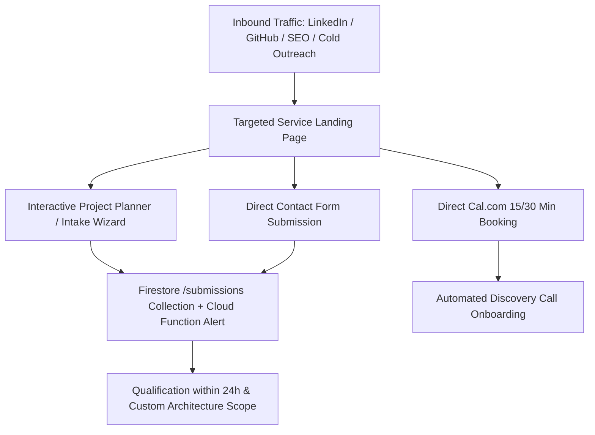

# Dossier 01: Business Model, Core Offerings & Commercial Strategy

## 1. Executive Summary & Brand Identity

- **Brand/Operator:** Youssef Fathalla
- **Positioning:** Senior Angular Architecture Specialist & Full-Stack Firebase Engineer.
- **Core Value Proposition:** Delivering enterprise-grade, high-performance web applications, architecture blueprints, and development velocity using Angular v22+, Signals state management, and Firebase serverless backends with zero technical debt and guaranteed SLAs.
- **Target Geographies:** Middle East / GCC region (Saudi Arabia, UAE, Qatar, Egypt), Europe, and North America.
- **Localization Strategy:** Native bilingual platform with deep Arabic (RTL) and English (LTR) parity, including complex Arabic pluralization rules, localized currency formatting, and cultural layout adaptations.

---

## 2. Target Buyer Personas & Strategic Alignment

```text
┌─────────────────────────────────────────────────────────────────────────────────┐
│                           TARGET BUYER PERSONAS                                 │
├──────────────────────────┬────────────────────────────┬─────────────────────────┤
│ 1. Startup Founders      │ 2. Enterprise CTOs & VPs   │ 3. Agencies & Leads     │
│ & Product Leaders        │ of Engineering             │ Needing Velocity        │
├──────────────────────────┼────────────────────────────┼─────────────────────────┤
│ • Needs: Fast MVP launch │ • Needs: Signals migration │ • Needs: On-demand dev  │
│ • Fears: Scope creep,    │ • Fears: AI security leaks │ • Fears: Long lock-ins  │
│   cost overruns, tech    │   and messy codebase debt  │   and slow delivery     │
│ • Primary Service:       │ • Primary Service:         │ • Primary Service:      │
│   Turnkey Fixed MVP &    │   Enterprise Team          │   Hourly Sprints &      │
│   Discovery Sprint       │   Augmentation             │   Tactical Audits       │
└──────────────────────────┴────────────────────────────┴─────────────────────────┘
```

### Persona 1: Non-Technical Founders & Early-Stage Startups (Seed / Series A)

- **Pain Points:** High agency quotes ($20k–$60k) with uncertain delivery, scope friction, junior developer code quality, and post-launch abandonment.
- **Pitch:** Fixed-price, 2–6 week turnaround with a 40/30/30 milestone payment schedule, transparent deliverables, and a 60-day post-launch bug warranty.

### Persona 2: Enterprise CTOs, VPs of Engineering & Tech Leads

- **Pain Points:** Architectural drift, sluggish performance from legacy NgModules/RxJS state, lack of strict typing, difficulty scaling complex multi-tenant systems.
- **Pitch:** Tier-1 GCC banking platform experience, 100% strict TypeScript (Zero-Any policy), Angular Signals & NgRx SignalStore specialization, Vitest unit test coverage, and strict local AI privacy governance (`.kiro` / `.cursorrules`).

### Persona 3: Product Managers & Digital Design Agencies

- **Pain Points:** Need pixel-perfect Figma implementation, tight sprint deadlines, lack of dedicated Angular front-end specialists.
- **Pitch:** Flexible on-demand hourly engineering blocks (10h, 20h, 40h), pixel-perfect TailwindCSS v4 / Angular Material MD3 conversions, WCAG 2.1 AA accessibility, and seamless API wiring.

---

## 3. Four Core Commercial Offerings & Pricing Models

### Offering 1: Paid Technical Discovery & Architecture Blueprint

- **Route:** `/services/architecture-blueprint` (and `/ar/services/architecture-blueprint`)
- **Target Audience:** Founders, Product Leaders, and CTOs preparing for a major build.
- **Investment:** Fixed **$2,500 – $4,500** (3 to 5 business days turnaround).
- **The "Trojan Horse" Credit Model:** 100% of the discovery fee is credited toward the full project if the client proceeds with the Turnkey MVP build within 30 days.
- **Core Deliverables:**
  1. Reactive State & Signal Architecture (Component Hierarchy Tree & route graph).
  2. Database Models & Firestore Schemas (with RBAC security rules and indexing strategy).
  3. API Contracts & TypeScript Interfaces (REST/GraphQL/Auth/Payments/External APIs).
  4. Phased Milestone Execution Roadmap (v1 MVP ➔ v1.1 Enhancements).
  5. Cloud Infrastructure & Cost Budget Forecast.

### Offering 2: Turnkey Fixed-Price MVP Engineering

- **Route:** `/services/fixed-mvp`
- **Target Audience:** Seed startups, business owners, and solo innovators.
- **Timeline:** **2 to 6 Weeks** typical turnaround.
- **Pricing Structure (40 / 30 / 30 Milestone Model):**
  - **Phase 1 (40% Deposit):** Project initiation, architecture setup, Figma translation, database schema modeling.
  - **Phase 2 (30% Beta Milestone):** Core interactive features built, staging server deployment, user acceptance testing.
  - **Phase 3 (30% Handover):** Production deployment, full repository/IP transfer, documentation, and warranty commencement.
- **Client Protections & Policies:**
  - **60-Day Bug Warranty:** 60 days of free, zero-cost bug resolution for any regression within original scope.
  - **Fair-Play Change Policy:** Free wireframe/requirement adjustments before coding starts; 1-to-1 complexity swapping for un-coded features.

### Offering 3: Enterprise Team Augmentation & Architecture Contracting

- **Route:** `/services/enterprise-augmentation`
- **Target Audience:** Enterprise engineering teams, financial platforms, multi-tenant SaaS.
- **Engagement Models:**
  - **Full-Time Augmentation (40 Hours/Week):** Direct embedding in sprint cycles, GitLab/GitHub MRs, Jira, daily standups.
  - **Part-Time Lead Contractor (20 Hours/Week):** Architectural steering, Signals refactoring, peer code reviews.
  - **Advisory & Code Quality Sprint:** Fixed block for security, performance, and accessibility audits.
- **Working Hours & Overlap:** Sunday to Thursday, 9:00 AM – 6:00 PM (EEST), providing 100% overlap with GCC, Middle East, and European teams.

### Offering 4: On-Demand Hourly Sprints & Tactical Audits

- **Routes:** `/services/hourly-sprints` & `/services/tactical-audits`
- **Target Audience:** Agencies, fast-moving teams, emergency performance/bug situations.
- **Sprint Packages:**
  - **Micro-Task Block (10 Hours):** 1–2 Figma screens, minor API wiring, or isolated bug fixes.
  - **Sprint Block (20 Hours):** Multi-step form wizards, interactive dashboards, or i18n/RTL integration.
  - **Dedicated Weekly Block (40 Hours):** 1-week intensive push, legacy refactoring, MVP acceleration.
- **Tactical Audits SLA:** 24–48 hour turnaround for critical production bug diagnostics, memory leak analysis, and re-render profiling.

---

## 4. Conversion Funnel & Inbound Lead Architecture



1. **Top of Funnel:** Direct persona links (`/services/fixed-mvp`, `/services/enterprise-augmentation`, `/services/architecture-blueprint`) shared via LinkedIn, outreach, and technical content.
2. **Mid-Funnel Lead Capture:**
   - Interactive multi-step project planner / intake wizard (`/contact` or embedded modal).
   - Direct Cal.com booking widgets for 15-min discovery calls or 30-min technical fit sessions.
   - Direct contact form backed by Firestore App Check and Cloud Function email triggers.
3. **Bottom of Funnel:** Instant proposal turnaround (within 24 hours) leveraging pre-architected estimation templates.

---

## 5. Competitive Differentiators

| Traditional Agency / Freelancer    | Youssef Fathalla's Operating Standard                                                          |
| :--------------------------------- | :--------------------------------------------------------------------------------------------- |
| **Vague Estimates & Hourly Creep** | Fixed-price milestones and transparent pre-estimated hourly ranges.                            |
| **Junior Outsourcing & Code Debt** | Senior-only execution with 100% strict TypeScript and zero `any` allowance.                    |
| **Clunky LTR-to-RTL Patches**      | True bilingual architecture from Day 1 using CSS logical properties and Arabic plural engines. |
| **Unprotected AI Usage**           | Isolated AI development environments (`.kiro` rules) with zero public model data leakage.      |
| **Abandonment Post-Launch**        | 60-day complimentary post-launch bug warranty included on all turnkey builds.                  |
