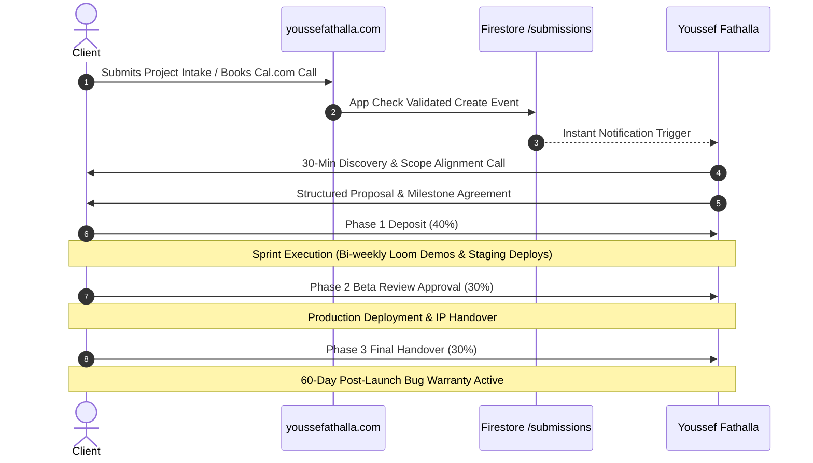

# Dossier 04: Project Roadmap, Growth Strategy & Client Operations

## 1. Project Evolution & Milestone Summary

```text
┌─────────────────────────────────────────────────────────────────────────────┐
│                            EXECUTION MILESTONES                             │
├───────────────────────────────────┬─────────────────────────────────────────┤
│ PHASE 1: Core Foundation [DONE]   │ PHASE 2: Commercial Services [DONE]     │
├───────────────────────────────────┼─────────────────────────────────────────┤
│ • Angular 22 Standalone Core      │ • Turnkey MVP Page (/services/fixed-mvp)│
│ • Signals State & OnPush Engine   │ • Enterprise Augmentation Page          │
│ • Express 5 SSR & Prerendering    │ • Hourly Sprints & Tactical Audits Pages│
│ • TailwindCSS v4 + Logical i18n   │ • Firestore /submissions Backend        │
│ • Zero-Any Rule & Vitest Suite    │ • 60-Day Warranty & Policies Page       │
├───────────────────────────────────┼─────────────────────────────────────────┤
│ PHASE 3: Navigation & UX [NEXT]   │ PHASE 4: Authority & Scale [FUTURE]     │
├───────────────────────────────────┼─────────────────────────────────────────┤
│ • Hierarchical Navigation Redesign│ • Technical Blog / Markdown Engine      │
│ • Architecture Blueprint Service  │ • Filterable Case Studies Gallery       │
│ • Ambient Motion & Transitions    │ • Client Portal (Invoices & Milestones) │
│ • Google Search Console Indexing  │ • Lead Magnet: Signals Steering Guide   │
└───────────────────────────────────┴─────────────────────────────────────────┘
```

---

## 2. Active Development Backlog (Next Sprints)

### Sprint 1: Navigation Redesign & Architecture Blueprint Launch

1. **Hierarchical Menu Architecture:**
   - Transition from a flat link list into structured category dropdowns on desktop and expandable accordions on mobile:
     - **Services:** Fixed-Price MVP, Enterprise Augmentation, Hourly Sprints, Tactical Audits, Architecture Blueprint.
     - **Work:** Case Studies, 4-Stage Workflow.
     - **About:** Tech Stack, Experience Timeline, Guarantees & Policies.
   - Add explicit, persistent `Home` link across all viewports.
   - Full keyboard navigation accessibility (`aria-haspopup`, `aria-expanded`, arrow keys, `Escape` to close).
2. **New Service Page: Front-End Architecture & Discovery Sprint:**
   - Implement route `/services/architecture-blueprint` (EN) and `/ar/services/architecture-blueprint` (AR).
   - Register in `route-manifest.ts` with sitemap priority `0.9`.
   - Create typed localized copy in `blueprint.content.ts`.
   - Cross-link from Turnkey MVP page as a low-friction entry point for pre-development clients.

### Sprint 2: Visual Polish, Ambient FX & Micro-Interactions

1. **Ambient Particle / Mesh Gradient Background:** Refined obsidian glassmorphism visual styling for the Hero section.
2. **Smooth Page Transitions:** Router animations facilitating seamless cross-fades between page loads.
3. **Route Skeleton Placeholders:** Visual skeleton states for asynchronous component rendering and assets.
4. **Enhanced 404 Not Found Experience:** Interactive search and navigational cues for missing routes.

### Sprint 3: Authority Platform & Long-Term Extensions

1. **Technical Blog & Case Study Engine:** Firestore/Markdown-backed technical articles showcasing Angular 22 Signals refactoring, modern engineering workflows, and system architecture deep-dives.
2. **Filterable Case Studies Gallery:** Category and tech stack filters (Signals, Firebase, Tailwind, SSR, Multi-Tenant).
3. **Client Portal:** Authenticated client area allowing clients to review project milestone progress, invoices, staging URLs, and open warranty tickets.

---

## 3. Profile Distribution & Go-To-Market Channels

### 3.1 Social & Outreach Profile Copy

- **LinkedIn Headline:**
  > Senior Angular Architecture Specialist & Full-Stack Firebase Engineer
- **LinkedIn Featured Links:**
  - **For Enterprise CTOs / Tech Leads:** `https://youssefathalla.com/services/enterprise-augmentation`
  - **For Startup Founders & Business Owners:** `https://youssefathalla.com/services/fixed-mvp`
- **GitHub & Community Bios:**
  > Senior Angular Architecture Specialist & Full-Stack Firebase Engineer. Building high-performance web applications with Angular Signals and Firebase. 🌐 <https://youssefathalla.com/>

### 3.2 Targeted Outreach Persona Mapping

| Target Outreach Segment               | Direct Destination URL              | Key Hook & Conversion Pitch                                                                                |
| :------------------------------------ | :---------------------------------- | :--------------------------------------------------------------------------------------------------------- |
| **Enterprise CTOs & VPs**             | `/services/enterprise-augmentation` | Angular v22+, Signals migration, 100% strict TypeScript, high-throughput delivery.                         |
| **Startup Founders (Early Stage)**    | `/services/fixed-mvp`               | 2–6 week turnaround, 40/30/30 milestone pricing, serverless architecture, 60-day post-launch bug warranty. |
| **Pre-Build / Figma-Ready Founders**  | `/services/architecture-blueprint`  | 1-week $2,500–$4,500 blueprint credited 100% toward full MVP build if initiated within 30 days.            |
| **Agencies / Teams with Backlogs**    | `/services/hourly-sprints`          | Flexible 10h/20h/40h engineering blocks, pixel-perfect Figma to Angular Material/Tailwind.                 |
| **Emergency Bug / Performance Leads** | `/services/tactical-audits`         | 24–48h emergency SLA for memory leaks, re-render lag, and broken state flows.                              |

---

## 4. Client Operations & Lifecycle Management



### 4.1 Onboarding & Discovery Process

1. **Intake & Qualification:** Client completes the interactive wizard or schedules an alignment call.
2. **Discovery Alignment (30 Mins):** Review product requirements, Figma designs, technical constraints, and timeline expectations.
3. **Formal Specification & Milestone Contract:** Detailed scope document with fixed pricing, delivery dates, and clear deliverable checkpoints.

### 4.2 Handover & Intellectual Property Transfer

Upon completion of Phase 3:

1. **Codebase Transfer:** Full ownership of GitHub/GitLab repositories transferred to client organization.
2. **Cloud Ownership:** Firebase/GCP project ownership transferred to client-controlled billing accounts.
3. **Documentation Package:** Comprehensive README, environment variable documentation, and operational guides.
4. **Warranty Activation:** 60 calendar days of free bug resolution starts immediately upon production launch.

### 4.3 Post-Warranty Maintenance Plans

After the 60-day warranty, clients can transition to an ongoing Care Plan:

- **Essential Care:** Security patches, dependency updates, uptime monitoring, and backup validation.
- **Growth Care:** Essential care + 10 dedicated monthly developer hours for feature iterations.
- **Enterprise Care:** High-priority SLA, dedicated monthly sprint blocks, and continuous performance tuning.
