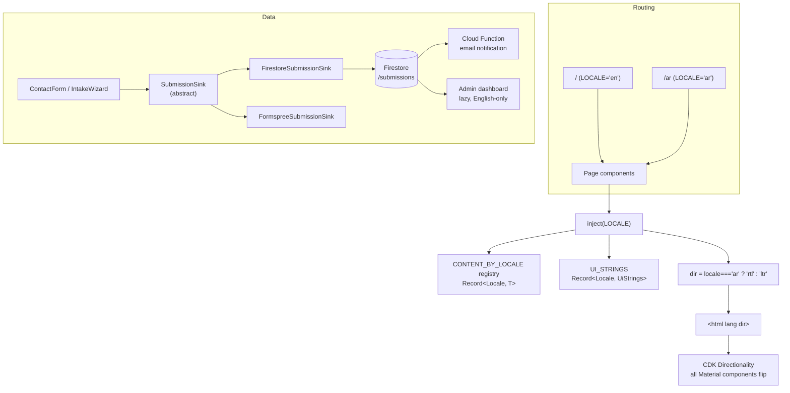

# Implementation Plan: Firebase, Angular Material, Arabic RTL, Admin Dashboard

Consolidates the outstanding work from `ROADMAP-1.md` and `ROADMAP-2.md` into a single
ordered sequence. Authored August 2026 against Angular 22.1.

## Table of Contents

- [Problem Statement](#problem-statement)
- [Confirmed Decisions](#confirmed-decisions)
- [Background: What the Codebase Enforces](#background-what-the-codebase-enforces)
- [Proposed Solution](#proposed-solution)
- [Task Breakdown](#task-breakdown)
  - [Phase 0: Baseline](#phase-0-baseline)
  - [Phase 1: Firebase Backend](#phase-1-firebase-backend)
  - [Phase 2: Angular Material Foundation](#phase-2-angular-material-foundation)
  - [Phase 3: Admin Dashboard](#phase-3-admin-dashboard-english-only)
  - [Phase 4: Arabic and RTL Infrastructure](#phase-4-arabic-and-rtl-infrastructure)
  - [Phase 5: Public Site Rebuild](#phase-5-public-site-rebuild-single-pass-per-component)
  - [Phase 6: Arabic Content](#phase-6-arabic-content)
  - [Phase 7: Verify and Ship](#phase-7-verify-and-ship)
- [Open Risks](#open-risks)
- [Task Checklist](#task-checklist)

---

## Problem Statement

Five interlocking workstreams, sequenced so no component template gets rewritten twice:

1. Replace Formspree with Firebase (Firestore, Auth, Cloud Functions) as the real backend.
2. Adopt Angular Material with a theme bridged to the existing dark glassmorphic tokens.
3. Add Arabic with full RTL/LTR support at `/ar/*`, SEO-complete.
4. Build the protected admin dashboard for viewing client submissions.
5. Re-run the `ROADMAP-2.md` production verification once the above lands.

---

## Confirmed Decisions

| Decision | Choice |
| --- | --- |
| i18n mechanism | Locale-keyed TypeScript content registry (not Transloco, not `@angular/localize`) |
| Arabic URLs | `/ar/*` prefix, additive. `/` stays English, existing indexed URLs untouched |
| Arabic slugs | English slugs under the `/ar/` prefix (`/ar/services/fixed-mvp`), not Arabic-script slugs |
| Translation scope | Everything: all content modules, all UI chrome |
| Arabic copy authorship | Drafted in Modern Standard Arabic for owner review before merge |
| Arabic typeface | Cairo, self-hosted WOFF2, matching the existing `@font-face` pattern |
| Admin dashboard | English-only |
| Firebase scope | Full: Firestore, Auth, Cloud Function notification, admin dashboard |
| Material theming | Token-bridged theme installed and wired; deeper visual customization follows separately |
| Bundle budget | Raised after measurement, with a guard keeping admin and Firestore out of the initial chunk |

### Why not Transloco

Site copy does not live in templates. It lives in strictly-typed TypeScript content
modules under `src/app/content/`, and `scripts/build-guards/run.ts` scans every string
in them. Moving copy to JSON translation files would cost three things this project
deliberately built:

- **Build guards stop working.** The currency/rate, unbound-numeral, and
  placeholder-token guards scan TypeScript content modules. JSON files bypass them, so
  Arabic copy would ship unguarded.
- **Type safety disappears.** With `assert-no-any` and 100% strict TypeScript in place, a
  missing or misspelled translation key should be a compile error, not a silent runtime
  fallback.
- **Structural parity is unenforced.** Content types are deeply shaped (nested
  `routeSpecificBlocks` discriminated unions, `packageTable` rows). JSON cannot guarantee
  the Arabic version matches the English shape.

A `Record<Locale, T>` registry gives compile-time parity enforcement, keeps the guards
running, adds no dependency, and (because SSR and prerendering are already in place)
produces fully translated static HTML per locale. SEO parity with build-time i18n is
determined by URL strategy and metadata, not by the translation mechanism.

---

## Background: What the Codebase Enforces

This project is unusually disciplined, and that discipline dictates the ordering.

**`ROUTE_MANIFEST`** (`src/app/core/routing/route-manifest.ts`) holds 10 route entries and
is the single source of truth for the route table, global nav links, canonical URLs,
breadcrumb trails, and the sitemap. Adding a locale dimension means extending
`RouteManifestEntry` and updating the four derivation functions (`toRoutes`,
`toLazyRoutes`, `toGlobalNavRouteLinks`, `buildBreadcrumbTrail`), not adding a parallel
structure.

**Build guards** (`scripts/build-guards/run.ts`) run on `prebuild`, import every content
module, and scan every string through pure, fast-check property-tested functions:
`findCurrencyOrRateViolations`, `findUnboundCommitmentNumerals`, `findPlaceholderTokens`,
`findRestrictedOrganizationNames`, plus `validateEffectiveDateStatement`,
`validateSelectorCardCount`, `validateWorkflowStages`, `validateStrictModeClaim`, and the
commercial-constants set. Every one of these regexes assumes English. Arabic copy must
flow through them or they silently stop guarding half the site.

**`generate-sitemap.mjs`** regex-parses the `ROUTE_MANIFEST` array literal for
`path: '...'` and reads `siteBaseUrl` from `environment.ts` without compiling TypeScript.
It needs to emit both locales plus `hreflang` alternates.

**`SeoService`** centralizes `<title>`, meta description, five `og:*` tags, four
`twitter:*` tags, and the canonical link through one private `applyMetadata`. Locale work
slots in there. `seo.assertions.ts` enforces "only the landing route may have a blank
`canonicalPath`", which stays valid because the Arabic landing is `'ar'`.

**`FormSubmissionService`** is already a clean seam: generic
`submit<TPayload>(payload): Observable<SubmitOutcome>`, 15-second timeout, every outcome
settled rather than thrown. Both `ContactForm` and `IntakeWizard` depend on it. Swapping
Formspree for Firestore means keeping that contract and changing the implementation.
`AnalyticsAdapter` in `app.config.ts` already establishes the abstract-class-plus-`useClass`
DI swap pattern to copy.

**Already installed:** `@angular/cdk@22.1.1`, so `@angular/material@^22.1` needs no
version negotiation. CDK `a11y` is in active use: `ConfigurableFocusTrapFactory` in the
mobile menu, `LiveAnnouncer` in both forms.

**Testing:** Vitest via `@angular/build:unit-test`, with `fast-check` property tests over
the guards.

**Not in the repo:** no `firebase.json`, no `.firebaserc`. App Hosting deployment is
currently CLI-side only, so Phase 1 starts from scratch on config.

---

## Proposed Solution

Three architectural choices worth stating explicitly:

**Locale via route-level providers, not URL sniffing.** Two route groups each provide a
`LOCALE` injection token through Angular's route-level `providers`. Components call
`inject(LOCALE)`. This is SSR-correct with zero runtime detection, and prerendering
produces fully translated static HTML per locale.

**`Record<Locale, T>` everywhere.** A missing Arabic translation becomes a TypeScript
compile error rather than a runtime fallback. This is the entire reason for choosing a
typed registry over Transloco.

**Raw `firebase` modular SDK, not `@angular/fire`.** Two reasons: `@angular/fire` peer-dep
support historically lags new Angular majors, and this codebase's style is hand-rolled
injectable services with strict typing and DI abstractions. A thin typed wrapper fits
better, ships less code, and avoids the peer-dep risk. See
[Open Risks](#open-risks) for the reversal path.

---

## Task Breakdown

### Phase 0: Baseline

#### Task 1: Capture pre-change production baseline

**Objective:** record "before" numbers so every later phase can be proven
non-regressive.

**Guidance:** Run a production build and note initial bundle size per chunk. Run
Lighthouse against the live site for mobile and desktop, saving Performance,
Accessibility, Best Practices, and SEO scores. Verify the current `sitemap.xml` is
submitted in Search Console and note the indexed-page count. Run the LinkedIn Post
Inspector and Twitter Card Validator against the landing page plus one service page. Do a
real Formspree submission and both Cal.com bookings end to end, confirming the calendar
invites arrive.

**Tests:** none, this is measurement. Record results in `plans/next/baseline.md`.

**Demo:** a written baseline table showing current bundle sizes, four Lighthouse scores
per viewport, working form and booking confirmations, and validated social cards.

---

### Phase 1: Firebase Backend

#### Task 2: Firebase project config and typed SDK wrapper

**Objective:** initialize Firebase in a browser-only, SSR-safe, strictly-typed way.

**Guidance:** Install `firebase` pinned to an exact version. Add `firebase.json` and
`.firebaserc` covering App Hosting, Firestore, and Functions. Extend `AppEnvironment` with
a `firebase` config block. Update the `environment.ts` doc comment, which currently states
"no API keys": Firebase web config including `apiKey` is public by design and is not a
secret, so that comment needs an explicit carve-out rather than being silently
contradicted. Create `core/firebase/firebase-app.service.ts` that lazily initializes the
app and gates Firestore behind the existing `isBrowser()` helper, so the server bundle
never pulls Firestore in.

**Tests:** unit test that the wrapper no-ops on the server platform and initializes
exactly once in the browser.

**Demo:** `npm run build` succeeds with Firestore absent from the server bundle; browser
console confirms a single initialization.

#### Task 3: Firestore submission sink behind a DI seam

**Objective:** move submissions to Firestore without changing either form component.

**Guidance:** Introduce an abstract `SubmissionSink` with the existing
`submit<TPayload>(payload): Observable<SubmitOutcome>` signature, mirroring how
`AnalyticsAdapter` is structured. Provide `FirestoreSubmissionSink` writing to
`/submissions` with `type`, `status: 'new'`, `createdAt`, `updatedAt`, `read: false`,
`payload`, `notes: ''`, and `tags: []`. Keep the existing Formspree implementation as
`FormspreeSubmissionSink`. Select between them in `app.config.ts` via the same flag-driven
`useClass` pattern. Preserve the 15-second timeout and the settled-outcome contract so
`ContactForm` and `IntakeWizard` need zero edits.

**Tests:** unit tests for success, permission-denied, network-failure, and timeout paths,
each asserting the correct `SubmitOutcome` variant. Assert both sinks satisfy the same
contract.

**Demo:** flip the flag and watch the same contact form write to Firestore instead of
Formspree, with identical UI feedback.

#### Task 4: Firestore security rules and abuse protection

**Objective:** allow public submission creation without opening a write endpoint to abuse.

**Guidance:** Write `firestore.rules` permitting `create` on `/submissions` only when the
document matches an exact field allowlist, has bounded string lengths, `status == 'new'`,
and a server timestamp. Deny all `read`, `update`, and `delete` except for an admin custom
claim. This is a security-critical task: a publicly writable collection is a spam and
billing-cost vector, so also enable Firebase App Check with reCAPTCHA v3 on the web app
and enforce it on Firestore.

**Tests:** emulator-based rules tests. Anonymous create with a valid payload succeeds;
create with extra fields, oversized strings, or a non-`new` status is rejected; anonymous
read is rejected; admin-claim read succeeds.

**Demo:** emulator test suite passing green across all allow and deny cases.

#### Task 5: Cloud Function notification on new submission

**Objective:** get emailed when a submission arrives instead of polling the console.

**Guidance:** Add a `functions/` workspace with a Firestore `onDocumentCreated` trigger on
`/submissions/{id}` that sends an email. Keep the mail provider credential in Functions
config or Secret Manager, never in `environment.ts`. Include basic rate limiting and a
spam heuristic that flips `status` to `'spam'` rather than notifying.

**Tests:** emulator test asserting the trigger fires once per created document, and that a
spam-heuristic hit sets `status: 'spam'` and suppresses the email.

**Demo:** submit the live form, receive the notification email, see the document in
Firestore.

#### Task 6: Cal.com webhook bridge to Firestore

**Objective:** surface booked calls in the admin dashboard alongside form submissions, so
there is one inbox instead of two.

**Guidance:** Add a second Cloud Function (HTTPS-triggered, not Firestore-triggered) that
receives Cal.com webhook payloads (`BOOKING_CREATED`, `BOOKING_RESCHEDULED`,
`BOOKING_CANCELLED`). Verify the webhook signature against a secret stored in Secret
Manager — the endpoint is publicly reachable, so without signature verification anyone can
inject fake bookings. On valid `BOOKING_CREATED`, write to `/submissions` with
`type: 'booking'`, `status: 'new'`, `read: false`, and the booking payload (invitee name,
email, event type, start time, timezone, reschedule URL). On `BOOKING_RESCHEDULED`, update
the existing document's payload and flip `status` back to `'new'`. On `BOOKING_CANCELLED`,
set `status: 'archived'`. Keep Cal.com's embed and booking URLs unchanged. Also confirm
that the `urgentBookingUrl` Cal.com event-type slug (`urgent-call`) actually exists, since
`environment.ts` has an open TODO about it and the audits page CTA depends on it.

**Tests:** unit tests for signature verification — valid signature passes, invalid or
missing signature returns 401. Integration test (emulator) asserting a
`BOOKING_CREATED` payload writes a correct document, `BOOKING_RESCHEDULED` updates it,
and `BOOKING_CANCELLED` archives it. Edge case: a `BOOKING_RESCHEDULED` for an unknown
booking ID creates a new document rather than throwing.

**Demo:** trigger a real test booking on Cal.com, see it appear in Firestore with
`type: 'booking'` and correct payload; reschedule it, see the document update; cancel it,
see `status` flip to `'archived'`.

---

### Phase 2: Angular Material Foundation

#### Task 7: Install Material and bridge the theme to existing tokens

**Objective:** get Material rendering in the existing palette, ready for visual
customization.

**Guidance:** Install `@angular/material@^22.1` matching the CDK already present. Create
`src/material-theme.scss` defining an M3 dark theme whose primary, secondary, and tertiary
map to `--color-accent-cyan`, `--color-accent-blue`, and `--color-accent-emerald`, with
surface colors from `--color-obsidian` and `--color-surface-glass`. Set Material typography
to Inter with the mono role as JetBrains Mono. Register the stylesheet in `angular.json`.
Verify Material's density and motion behavior respects the existing
`prefers-reduced-motion` overrides in `styles.scss`. Deeper visual customization is
deliberately left as follow-on work; this task establishes the token bridge and a clean
seam for it.

**Planned component set:**

| Component | Where it goes |
| --- | --- |
| `MatFormField`, `MatInput` | Contact form, intake wizard, admin login |
| `MatSelect` | Contact form project-type field |
| `MatStepper` | Intake wizard (replaces custom step machine) |
| `MatExpansionPanel` | FAQ blocks on every service page |
| `MatSnackBar` | Submission feedback, clipboard confirmation, admin saves |
| `MatButton`, `MatIconButton` | All CTAs, nav toggle, stepper navigation |
| `MatIcon` | Replaces the custom `Icon` component via `MatIconRegistry` |
| `MatChipSet` | Stack tech chips, admin submission tags |
| `MatTable`, `MatSort`, `MatPaginator` | Package table, care-plan table, admin submissions list |
| `MatDialog` | Admin destructive-action confirmation |
| `MatTooltip` | Trust bar stats, tech stack abbreviations |

**Deliberately not adopted:** `MatSidenav` (the existing CDK focus-trap mobile menu is
better suited), `MatToolbar` (the custom sticky glass nav is already stronger), `MatCard`
(existing glass cards are too custom to benefit), `MatDatepicker`, `MatSlideToggle`,
`MatAutocomplete`, and `MatProgressBar` (no use case).

**Tests:** a scratch route rendering one of each planned component; a unit test asserting
theme CSS custom properties resolve to the expected token values.

**Demo:** a component gallery page showing every planned component in the dark palette.

#### Task 8: Measure and reset bundle budgets

**Objective:** replace the current 500 kB ceiling with a measured, enforced one.

**Guidance:** Build production and record the real initial size with Material present. Set
`maximumWarning` and `maximumError` roughly 10% above measured rather than guessing. Extend
`scripts/assert-build-output.mjs` with an assertion that neither the Firestore SDK nor any
admin chunk appears in the initial bundle, so lazy-loading cannot silently regress. The
8 kB per-component-style cap may need a small bump for Material-heavy components.

**Tests:** `npm run assert-build` fails when a deliberately eager Firestore import is
introduced, and passes once reverted.

**Demo:** build output showing initial size within the new budget, with admin and Firestore
confirmed as separate lazy chunks.

---

### Phase 3: Admin Dashboard (English-only)

#### Task 9: Firebase Auth, guard, and login page

**Objective:** gate `/admin` behind authentication.

**Guidance:** Build `AuthService` wrapping Firebase Auth email/password with signal-based
auth state. Add a functional `CanActivateFn` guard redirecting unauthenticated users to
`/admin/login` and preserving the return URL. Build the login page with `MatFormField`,
`MatInput`, and `MatButton`. Register `/admin` as a lazy route group excluded from
`ROUTE_MANIFEST` so it never reaches the sitemap, nav, or breadcrumbs, and add `noindex`.
State clearly in code comments that the route guard is UX only: the Firestore rules from
Task 4 are the actual enforcement boundary.

**Tests:** guard redirects when unauthenticated and permits when authenticated; login
surfaces a friendly error on bad credentials; `/admin` paths are absent from generated
sitemap output.

**Demo:** visiting `/admin` bounces to login; correct credentials land on an empty
dashboard shell.

#### Task 10: Admin shell and overview stats $([char]0x2713)

**Objective:** a navigable dashboard frame with at-a-glance numbers.

**Delivered:** Admin_Shell component with sidebar (Overview/Submissions links with

outerLinkActive), header showing authenticated email + logout button, skip-to-content
link, CSS-only icon-rail collapse below 1024px. Overview_Page with four independent
CountState signal cards (Total/Unread/In Progress/This Week) driven by
OverviewCountsService using getCountFromServer aggregates. A Count_Beacon
onSnapshot(orderBy updatedAt desc, limit 1) re-issues all four aggregates on every
mutation. Per-card skeleton/ready/error+retry rendering with 5-second timeout. Empty-state
message when total is zero. Responsive CSS grid. Admin-local inline SVG sprite component
(AdminIcon) replacing Material Icons font (project ships no icon font per R14.2).

**Demo:** log in and see live submission counts (14 total, 14 unread, 0 in progress, 14
this week) with working sidebar navigation.

#### Task 11: Submissions list with filter, sort, and search

**Objective:** browse and triage every submission.

**Guidance:** Build the list on `MatTable` with `MatSort` and `MatPaginator`, backed by a
paginated Firestore query. Filter by type, status, and tags; search by name or email. Add a
real-time `onSnapshot` listener so new submissions appear without a refresh. Add bulk
select with archive and mark-all-read, plus CSV and JSON export.

**Tests:** query-builder unit tests for each filter combination; a test that the real-time
listener prepends new documents; a CSV export test asserting correct escaping of commas,
quotes, and newlines in user-supplied content.

**Demo:** submit the public form in one tab and watch the row appear live in the admin tab,
then filter, sort, bulk-archive, and export.

#### Task 12: Submission detail view with status workflow

**Objective:** read one submission fully and act on it.

**Guidance:** Detail route rendering the complete payload, an editable internal notes
field, a status selector (`new`, `in-progress`, `archived`, `spam`), and tag management via
`MatChips`. Use `MatSnackBar` for save confirmations and `MatDialog` to confirm destructive
actions. Mark `read: true` on open.

**Tests:** opening flips `read`; status and notes persist; the dialog blocks an unconfirmed
destructive action.

**Demo:** open a submission, add notes and tags, change status, see the list reflect it
immediately.

---

### Phase 4: Arabic and RTL Infrastructure

#### Task 13: Locale primitives and the content registry pattern

**Objective:** establish the typed locale foundation with no visible change yet.

**Guidance:** Add `core/i18n/locale.ts` with `Locale = 'en' | 'ar'`, `LOCALES`,
`DEFAULT_LOCALE`, `Direction`, a `directionFor(locale)` helper, and a `LOCALE` injection
token. Add `LocalizedText = Record<Locale, string>`. Restructure content modules so each
exports `Record<Locale, T>`, starting with one small module (`nav-links.content.ts`) to
prove the pattern end to end before touching the rest. Arabic entries can start as copies
of the English text; Task 22 replaces them.

**Tests:** type-level test confirming an incomplete `Record<Locale, T>` fails compilation;
unit test for `directionFor`.

**Demo:** `inject(LOCALE)` resolves in a component and returns correctly typed content for
the chosen locale.

#### Task 14: Locale-aware routing and document direction

**Objective:** `/ar/*` routes resolve and the document flips direction.

**Guidance:** Extend `RouteManifestEntry` so `navLabel` is `LocalizedText` and `metadata`
is `Record<Locale, RouteMetadata>`. Add `toLocalizedPath(path, locale)` producing `''` and
`'services'` for English, `'ar'` and `'ar/services'` for Arabic. Build two route groups in
`app.routes.ts`, each providing `LOCALE` via route-level `providers`, preserving the
existing eager-landing and lazy-everything-else split for both. Give each locale its own
wildcard 404. Update `toGlobalNavRouteLinks` and `buildBreadcrumbTrail` to be locale-aware.
Set `<html lang>` and `<html dir>` from the active locale in an SSR-safe way, and verify
CDK `Directionality` picks it up: that is the single hinge that makes every Material
component flip.

**Tests:** extend the existing route-manifest property tests to cover both locales; assert
no duplicate paths across the combined table; assert breadcrumb trails resolve correctly
for Arabic paths; assert `dir` and `lang` are correct in prerendered HTML for both locales.

**Demo:** `/ar/services/fixed-mvp` renders with `dir="rtl"`, correct Arabic breadcrumbs,
and Material components mirrored.

#### Task 15: Locale-complete SEO and sitemap

**Objective:** make Arabic fully indexable without disturbing English rankings.

**Guidance:** Extend `SeoService.applyMetadata` to emit `og:locale`,
`og:locale:alternate`, a per-locale canonical, and reciprocal `hreflang` alternates
including `x-default` pointing at English. Update `generate-sitemap.mjs` to emit both
locales with `xhtml:link` alternates per entry. Confirm `seo.assertions.ts` still holds:
the Arabic landing's `canonicalPath` is `'ar'`, non-blank, so the landing-only exemption
stays intact. Verify the not-found path still renders zero canonical links in both locales.

**Tests:** unit tests asserting canonical and `hreflang` correctness for every manifest
entry in both locales; a sitemap snapshot test with double the entry count and valid
alternates; a test that English canonical URLs are byte-identical to their pre-change
values, proving no ranking disruption.

**Demo:** generated `sitemap.xml` with both locales and valid alternates; view-source on an
Arabic page showing complete correct metadata.

#### Task 16: Cairo font and RTL-safe global styles

**Objective:** Arabic renders in proper typography with direction-agnostic layout
primitives.

**Guidance:** Self-host Cairo 400 and 600 as WOFF2 in `public/fonts/`, following the
existing `font-display: swap` pattern in `styles.scss`. Add `--font-sans-ar` to the
`@theme` block and apply it under `[lang="ar"]`. Sweep global styles and the `.glass`
utility for physical properties, converting to logical equivalents (`margin-inline-start`,
`padding-inline-end`, and the Tailwind `ms-*`, `me-*`, `ps-*`, `pe-*` utilities). Make the
`appReveal` GSAP directive direction-aware so horizontal reveals read inward in both
directions rather than animating backwards in RTL.

**Tests:** unit test asserting `appReveal` computes inverted x-offsets under RTL; visual
check that Cairo loads and no layout depends on physical direction.

**Demo:** side-by-side English and Arabic screenshots with correct typography and
correctly-directioned reveal animations.

---

### Phase 5: Public Site Rebuild (single pass per component)

Each task here applies the shared layout container, Material, logical CSS, and
locale-aware content together, so no template is edited four separate times.

#### Task 17: Introduce the shared layout container

**Objective:** give every public route one consistent, direction-agnostic bounded content
measure, replacing today's three competing mechanisms and six unconstrained pages. This
lands before the rest of Phase 5 so those templates are not edited twice.

**Guidance:** Today the site has no single answer for "how wide is page content."
`<main id="main-content">` in `app.html` carries no constraint at all. `home.html` repeats
`mx-auto max-w-7xl px-4 lg:px-8` inside each of its seven sections. `site-nav.html` has its
own inner `mx-auto flex w-full max-w-7xl`. `not-found.html` uses `mx-auto max-w-2xl px-4
lg:px-8`. `component-gallery.scss` is the only `:host` with a `max-width`. And `workflow`,
`services-hub`, `policies`, `contact`, `case-studies`, and `ServicePageTemplate` have no
container and no horizontal padding at all, so they render edge-to-edge against the
viewport — the reported "full width doesn't look good" defect.

Introduce one shared container primitive (component or directive, a design call) with two
measures. **wide** is the default at `max-w-7xl`, sized and guttered so page content aligns
vertically with the `SiteNav` bar's inner measure; it covers page shells, card grids, and
`MatTable` regions. **prose** is a narrower 65-75ch measure for paragraph-heavy blocks,
formalizing the ad-hoc `max-w-3xl` already hand-applied in `policies.html` and
`sections/agency/agency.html`. Adopt it on every public route, collapse `Home`'s seven
duplicated wrappers into it, and include `NotFound` and `ServicePageTemplate`. Preserve the
current gutters at `px-4 lg:px-8`. Express the container exclusively in logical properties:
Tailwind's `mx-*` and `px-*` already compile to `margin-inline`/`padding-inline`, so it is
RTL-safe by construction and must not introduce a `findPhysicalDirectionProperties`
violation. Decide whether full-bleed section backgrounds need an escape hatch, given
`Home`'s sections currently wrap rather than bleed. The component gallery and the admin
route group keep their existing layout and are out of scope.

**Tests:** unit test asserting the wide measure's resolved inline size and gutters match
`SiteNav`'s inner measure; a test asserting every public route template renders its content
inside a container; guard test asserting no physical direction property is introduced.

**Demo:** every public route bounded and centered at a consistent measure, aligned with the
nav bar, identical in LTR and RTL, with no route rendering edge-to-edge.

#### Task 18: Rebuild forms with Material

**Objective:** the highest-value Material conversion.

**Guidance:** Convert `ContactForm` to `MatFormField`, `MatInput`, `MatSelect`, and
`MatButton`, replacing inline status paragraphs with `MatSnackBar`. Rebuild `IntakeWizard`
on `MatStepper`, replacing the custom `@switch` step machine and hand-rolled focus
management, with `MatRadioGroup` for the three option steps. Preserve the no-JS fallback
path and the existing `LiveAnnouncer` announcements: both are deliberate accessibility
features, and Material's built-in behavior is not a drop-in substitute for either. Pull all
labels, placeholders, and validation messages from the locale-aware UI string dictionary.

**Tests:** existing form validation and submission tests must pass unchanged against the
Material markup; add RTL rendering tests; assert the no-JS fallback still renders every
step; assert step-change announcements still fire.

**Demo:** both forms in Material styling, working in English and Arabic, submitting to
Firestore, with the no-JS path intact.

#### Task 19: Rebuild shared components and navigation

**Objective:** convert the remaining reusable UI.

**Guidance:** Convert `FaqBlock` from native `
` to `MatAccordion` and
`MatExpansionPanel`, keeping answers present in prerendered HTML for SEO. Replace the
custom `Icon` component with `MatIcon` plus a `MatIconRegistry` of the existing SVGs.
Convert `ConversionCtaGroup` buttons to `MatButton` variants. Convert stack chips to
`MatChipSet`. Keep the custom sticky nav and mobile menu, since the existing CDK
focus-trap implementation is better suited than `MatSidenav`, but add the language switcher
to the nav and convert the toggle to `MatIconButton`. Route every string through the locale
dictionary.

**Tests:** FAQ answers present in DOM when collapsed; icon registry resolves every name;
language switcher preserves the current route across locales; mobile menu focus trap and
Escape behavior unchanged.

**Demo:** full public site in Material styling with a working language switcher that stays
on the same page.

#### Task 20: Localize remaining page content wiring

**Objective:** every remaining page reads locale-aware content.

**Guidance:** Convert the remaining content modules to `Record<Locale, T>` and update
`ServicePageTemplate`, `Home`, `Policies`, `CaseStudies`, `Workflow`, `ServicesHub`, and
`NotFound` to read through `inject(LOCALE)`. Convert `PackageTable` and `CarePlanTable` to
`MatTable` where the semantics benefit, keeping the existing scrollable-region
accessibility affordances.

**Tests:** every page renders in both locales without missing-content errors; a
registry-completeness test asserting every content export has an entry for every locale.

**Demo:** every route navigable in both English and Arabic with correct direction and
typography.

---

### Phase 6: Arabic Content

#### Task 21: Make build guards locale-aware

**Objective:** Arabic copy must be guarded as strictly as English. This has to land
**before** the Arabic copy, or the guards silently stop covering half the site.

**Guidance:** Update `run.ts` to iterate locales and scan every locale's content. Keep
numerals in Arabic copy as Latin digits, which is standard in Arabic technical and business
writing, so the existing `DIGIT_SEQUENCE_PATTERN` and currency/rate logic keeps working
without a rewrite. Add locale-keyed exemption phrases for `findUnboundCommitmentNumerals`.
Refactor the effective-date guard to validate a machine-readable ISO constant that both
locales' prose interpolate, which removes locale-specific date-regex parsing entirely. Add
Arabic claim patterns to `validateStrictModeClaim` so the tsconfig cross-check still
functions in Arabic.

**Tests:** extend the existing fast-check property suites to cover Arabic inputs; assert a
deliberately planted Arabic currency violation is caught; assert an Arabic strict-mode
claim is cross-checked against tsconfig.

**Demo:** `npm run prebuild` scanning both locales, catching planted violations in either.

#### Task 22: Draft and review Arabic content

**Objective:** real Arabic copy across every content module.

**Guidance:** Draft Modern Standard Arabic for every module, in dependency order, with
metadata titles and descriptions kept inside the character bounds `seo.assertions.ts`
enforces (30 to 60 for titles, 120 to 160 for descriptions). Keep technical terms (Angular,
Firebase, TypeScript, Signals) in Latin script as is conventional. Submit in reviewable
batches rather than one large drop, so review load stays manageable and corrections
propagate to later drafts.

**Tests:** guards pass for all Arabic content; SEO assertions pass for every Arabic route;
registry-completeness test green.

**Demo:** every page in fully translated, reviewed Arabic with all guards and assertions
passing.

---

### Phase 7: Verify and Ship

#### Task 23: Full verification against baseline

**Objective:** prove nothing regressed and the new surface is sound.

**Guidance:** Re-run everything from Task 1 and diff against the baseline. Production
Lighthouse for both locales on mobile and desktop, targeting the 95+ Performance and 100
Accessibility bar from `ROADMAP-2.md`. Confirm English URLs are byte-identical to before.
Screen-reader pass over both locales, checking direction, announcements, and focus order.
Verify Material's RTL mirroring on every converted component. Confirm no secrets in the
client bundle and that App Check is enforcing. Re-validate social cards.

**Tests:** full suite green; `assert-build` and `assert-no-any` passing; emulator rules
tests passing.

**Demo:** a comparison table against baseline showing bundle sizes and Lighthouse scores
per locale per viewport, plus a verification checklist with explicit notes on anything that
could not be verified automatically.

#### Task 24: Search Console and distribution updates

**Objective:** get Arabic indexed and close out `ROADMAP-2.md`.

**Guidance:** Resubmit the updated sitemap and request indexing for the Arabic routes.
Confirm `hreflang` in Search Console's international targeting report. Then work the
remaining `ROADMAP-2.md` sections: LinkedIn headline and featured links, GitHub and
community bios, and the persona-targeted outreach URLs. These are manual account actions
outside the repo, so the deliverable is exact copy and a link list ready to paste.

**Tests:** none, external verification.

**Demo:** Arabic routes appearing in Search Console with no `hreflang` errors, and a
ready-to-paste distribution checklist.

---

## Open Risks

### 1. `@angular/fire` versus raw SDK

The plan assumes the raw `firebase` modular SDK wrapped in bespoke injectable services,
because `@angular/fire` peer-dep support tends to lag new Angular majors and this project
is on 22.1. If `@angular/fire` supports 22 cleanly and its `collectionData` observables and
zone integration are preferred, that is a reasonable swap affecting only Tasks 2, 3, 9, 11,
and 12.

### 2. Public Firestore writes are a real exposure

Letting anyone create documents in `/submissions` is necessary for a public contact form
but is a spam and billing-cost vector. Task 4 covers strict rules validation plus App
Check, and Task 5 adds rate limiting. The more secure alternative is routing submissions
through an HTTPS Cloud Function so the collection stays entirely closed: slightly more
latency and one more moving part, but no public write surface at all.

### 3. Task 22 is the long pole

Translating every content module is the bulk of the calendar time and is gated on review.
For something shippable sooner, land Phases 0 through 3 plus Phase 7 first (Firebase,
Material, admin dashboard, verification) and treat Arabic as a second release. That gets
the admin dashboard delivered significantly earlier.

---

## Task Checklist

### Phase 0: Baseline

- [x] Task 1: Capture pre-change production baseline

### Phase 1: Firebase Backend

- [x] Task 2: Firebase project config and typed SDK wrapper
- [x] Task 3: Firestore submission sink behind a DI seam
- [x] Task 4: Firestore security rules and abuse protection
- [x] Task 5: Cloud Function notification on new submission
- [x] Task 6: Cal.com webhook bridge to Firestore

### Phase 2: Angular Material Foundation

- [x] Task 7: Install Material and bridge the theme to existing tokens
- [x] Task 8: Measure and reset bundle budgets

### Phase 3: Admin Dashboard

- [x] Task 9: Firebase Auth, guard, and login page
- [x] Task 10: Admin shell and overview stats
- [x] Task 11: Submissions list with filter, sort, and search
- [x] Task 12: Submission detail view with status workflow

### Phase 4: Arabic and RTL Infrastructure

- [x] Task 13: Locale primitives and the content registry pattern
- [x] Task 14: Locale-aware routing and document direction
- [x] Task 15: Locale-complete SEO and sitemap
- [x] Task 16: Cairo font and RTL-safe global styles

### Phase 5: Public Site Rebuild

- [x] Task 17: Introduce the shared layout container
- [x] Task 18: Rebuild forms with Material
- [x] Task 19: Rebuild shared components and navigation
- [x] Task 20: Localize remaining page content wiring

### Phase 6: Arabic Content

- [x] Task 21: Make build guards locale-aware
- [x] Task 22: Draft and review Arabic content

### Phase 7: Verify and Ship

- [x] Task 23: Full verification against baseline
- [x] Task 24: Search Console and distribution updates
